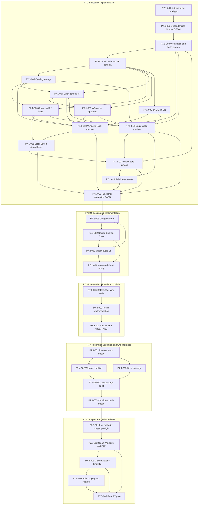

# P6 共享实现依赖 DAG 与 P7 硬序

## 1. 冻结结论

- **状态**：`P6_IMPLEMENTATION_DAG_FROZEN_FOR_REVIEW`
- **权威task明细**：`04-p7-task-and-commit-matrix.tsv`
- **图类型**：有向无环图（DAG）
- **task nodes**：`32`
- **cycle count**：`0`
- **硬阶段顺序**：`P7.1 -> P7.2 -> P7.3 -> P7.4 -> P7.5`
- **共享业务实现数**：`1`
- **长期local/public fork数**：`0`
- **最终包数**：`2`

本文件给出`04`机器矩阵的同构、人类可审查DAG；节点ID与dependencies必须逐项一致。task可以在满足前置后并行，但不能跨越阶段硬门。发现缺陷时停止并回到最早失败task，不在图中加入回边，也不允许后续task静默重写冻结合同。

## 2. 全部节点与直接依赖

| task ID | subphase | 责任摘要 | 直接依赖 |
|---|---|---|---|
| `P7.1-001` | P7.1 | 授权、dirty-worktree与branch preflight | `NONE` |
| `P7.1-002` | P7.1 | dependency lock、license与初始SBOM | `P7.1-001` |
| `P7.1-003` | P7.1 | 单一workspace、shared/adapter/entry与build guard | `P7.1-002` |
| `P7.1-004` | P7.1 | shared domain identity与typed API schema | `P7.1-003` |
| `P7.1-005` | P7.1 | Catalog discovery/normalize/storage/observations | `P7.1-004` |
| `P7.1-006` | P7.1 | query、FilterSchema与22筛选 | `P7.1-004`,`P7.1-005` |
| `P7.1-007` | P7.1 | Open scheduler/reconcile/freshness/observations | `P7.1-004`,`P7.1-005` |
| `P7.1-008` | P7.1 | WebSocket/watch/episode/notification events | `P7.1-004`,`P7.1-007` |
| `P7.1-009` | P7.1 | shared en-US/zh-CN与error-key contract | `P7.1-004` |
| `P7.1-010` | P7.1 | Windows local runtime/persistence/history/config clocks | `P7.1-003`,`P7.1-005`,`P7.1-006`,`P7.1-007`,`P7.1-008`,`P7.1-009` |
| `P7.1-011` | P7.1 | LOCAL_ONLY Saved views与Reset scopes | `P7.1-006`,`P7.1-010` |
| `P7.1-012` | P7.1 | Linux public runtime/session/fixed clocks/service state | `P7.1-003`,`P7.1-005`,`P7.1-006`,`P7.1-007`,`P7.1-008`,`P7.1-009` |
| `P7.1-013` | P7.1 | public zero-surface与双target build enforcement | `P7.1-003`,`P7.1-011`,`P7.1-012` |
| `P7.1-014` | P7.1 | 无生产变更的public operations assets | `P7.1-012`,`P7.1-013` |
| `P7.1-015` | P7.1 Gate | 正式视觉实现前的双entry功能集成门 | `P7.1-010`,`P7.1-011`,`P7.1-012`,`P7.1-013`,`P7.1-014` |
| `P7.2-001` | P7.2 | UI design system与responsive shell | `P7.1-015` |
| `P7.2-002` | P7.2 | course-centered search/filter/Section flows | `P7.2-001` |
| `P7.2-003` | P7.2 | watch/toast/audio/freshness/subscription UI | `P7.2-001`,`P7.2-002` |
| `P7.2-004` | P7.2 Gate | local/public composition、i18n、a11y与视觉验证 | `P7.2-002`,`P7.2-003` |
| `P7.3-001` | P7.3 | 独立Before/After/Why UI审计 | `P7.2-004` |
| `P7.3-002` | P7.3 | 仅按审计实施UI polish | `P7.3-001` |
| `P7.3-003` | P7.3 Gate | post-polish真实UI重验证 | `P7.3-002` |
| `P7.4-001` | P7.4 | 最终集成验证与release input freeze | `P7.3-003` |
| `P7.4-002` | P7.4 | Windows local archive构建与验证 | `P7.4-001` |
| `P7.4-003` | P7.4 | Linux public package构建与验证 | `P7.4-001` |
| `P7.4-004` | P7.4 | 双包provenance/secret/license/content audit | `P7.4-002`,`P7.4-003` |
| `P7.4-005` | P7.4 Gate | deterministic clean-environment候选验收、双包hash冻结与P7.5入口 | `P7.4-004` |
| `P7.5-001` | P7.5 Gate | live权限、候选hash、请求预算与Windows/Actions/Vultr环境即时preflight | `P7.4-005` |
| `P7.5-002` | P7.5 | 干净Windows真实Rutgers候选包E2E | `P7.5-001` |
| `P7.5-003` | P7.5 | GitHub Actions Linux真实世界自动化层 | `P7.5-002` |
| `P7.5-004` | P7.5 | 指定Vultr staging真实Caddy/HTTPS E2E与基线恢复 | `P7.5-003` |
| `P7.5-005` | P7.5 Gate | 三环境同hash汇总、最终P7完成与Release申请资格 | `P7.5-002`,`P7.5-003`,`P7.5-004` |

## 3. DAG图



该图所有边均在`04`的dependencies中存在；图中没有adapter→shared反向边、local↔public边、P7.3→P7.2回边或P7.5→实现阶段回边。`P7.4-002`与`P7.4-003`可以并行，但必须消费同一个`P7.4-001`冻结source revision、lock与toolchain。P7.5三个真实环境严格串行并消费不变candidate hash；发现产品缺陷时图外停止并回到最早owner task，重新经过P7.4生成两个新hash后，全部P7.5从头重跑，不能现场修包或加入DAG回边。

## 4. P7.2 与 P7.3 强制隔离

### 4.1 P7.2

`P7.2-001..004`每个task都必须记录并使用：

- `$industrial-brutalist-ui`
- `$design-taste-frontend`

P7.2从已经通过双entry功能集成的`P7.1-015`开始，完成同一套产品UI的正式视觉系统、course/section、watch/audio、local/public composition、desktop/mobile、i18n和accessibility。`P7.2-004`必须生成独立completion record与真实视觉证据；未得到`P7_2_INTEGRATED_VISUAL_PASS`不得启动P7.3。

### 4.2 P7.3

`P7.3-001`只能直接依赖`P7.2-004`。它先基于已集成UI形成独立`Before | After | Why`；`P7.3-002`再只使用：

- `$emil-design-eng`

P7.3与P7.2必须使用不同task ID、不同完成记录和不同commit boundary。`P7.3-003`重新执行desktop/mobile视觉、accessibility、性能、local/public zero-surface与功能回归；不能复用P7.2截图冒充完成。

## 5. Shared、local与public依赖方向

```text
shared domain/catalog/query/open/watch/i18n
             |                         |
             v                         v
Windows local runtime            Linux public runtime
Saved/history/reset              ephemeral/fixed/service state
             |                         |
             +---- shared UI ----------+
```

- shared bug只能在`P7.1-004..009`对应owner修复；不得在`P7.1-010`和`P7.1-012`复制patch。
- local与public可在shared前置满足后并行，但互不依赖；`P7.1-013`只审计两张source/build graph，不把它们合成feature-switched单体binary。
- `P7.1-014`只创建无真实secret/domain的operations assets，`production=false`。
- 两个package build节点属于一个source主线的两个target，不是两个长期branch。
- `P7.5`只消费两个P7.4候选包并生成去敏验证证据，不重建包，也不建立第三个package节点。

## 6. 第01/02执行视图到04节点的映射

第01文档的`L-*`只是本地交付阅读顺序，映射如下：

| Local view | Canonical task |
|---|---|
| `L-00` | `P7.1-001..003` |
| `L-01` | `P7.1-004` |
| `L-02`,`L-03` | `P7.1-005` |
| `L-04` | `P7.1-006` |
| `L-05` | `P7.1-010`,`P7.1-011` |
| `L-06` | `P7.1-007` |
| `L-07` | `P7.1-008`,`P7.1-010` |
| `L-08` | `P7.1-009`,`P7.1-013`,`P7.1-015` |
| `L-09` | `P7.2-001..004` |
| `L-10` | `P7.3-001..003` |
| `L-11` | `P7.4-001`,`P7.4-002`,`P7.4-004` |
| `L-12` | `P7.4-005` |
| `L-13` | `P7.5-001`,`P7.5-002`,`P7.5-005` |

第02文档的`P-*`是公网交付阅读顺序：

| Public view | Canonical task |
|---|---|
| `P-00`,`P-01`,`P-02` | `P7.1-003`,`P7.1-012` |
| `P-03` | `P7.1-013` |
| `P-04` | `P7.1-009`,`P7.1-015` |
| `P-05` | `P7.2-001..004` |
| `P-06` | `P7.3-001..003` |
| `P-07` | `P7.1-014`,`P7.4-001`,`P7.4-003`,`P7.4-004` |
| `P-08` | `P7.4-005` |
| `P-09` | `P7.5-001`,`P7.5-003`,`P7.5-004`,`P7.5-005` |

若阅读视图与`04`行冲突，以`04`的canonical task ID、dependencies、skills、commit boundary与stop gate为准；不得因此新增重复task或实现。

## 7. DAG机器验收

P7开始前与每次task矩阵调整后必须：

1. 校验32个task ID唯一、所有dependency存在且不自依赖；
2. Kahn topological sort访问32/32节点，剩余0，cycle count为0；
3. 所有P7.2节点可追溯到`P7.1-015`；首个P7.3节点依赖显式P7.2视觉门；首个P7.4节点依赖显式P7.3重验证门；首个P7.5节点只依赖`P7.4-005`候选门；
4. P7.2 required skills包含两项指定skill，P7.3只包含指定Emil skill；二者commit/record/stop gate不相同；
5. `P7.4-002/003`均依赖`P7.4-001`，`P7.4-004`等待两包，`P7.4-005`冻结恰好两个candidate hash；
6. `P7.5-002/003/004`分别承担Windows、GitHub Actions、Vultr staging环境，`P7.5-005`等待三者并持有唯一最终P7 completion record；
7. P7 DAG中真实production mutation节点数为0；Vultr staging mutation只能出现在独立精确授权后的`P7.5-004`；最终package cardinality始终为2。

```text
phase=P6
status=P6_IMPLEMENTATION_DAG_FROZEN_FOR_REVIEW
task_node_count=32
dag_cycle_count=0
p7_order=P7.1>P7.2>P7.3>P7.4>P7.5
p7_1_task_count=15
p7_2_task_count=4
p7_3_task_count=3
p7_4_task_count=5
p7_5_task_count=5
shared_business_logic_implementation_count=1
long_lived_fork_count=0
p7_2_skills=$industrial-brutalist-ui+$design-taste-frontend
p7_3_skill=$emil-design-eng
p7_3_requires_p7_2_integrated_visual_pass=TRUE
p7_2_p7_3_same_task=FALSE
p7_2_p7_3_same_record=FALSE
p7_2_p7_3_same_commit=FALSE
final_package_count=2
production_nodes_in_p7_dag=0
vultr_staging_mutation_nodes_in_p7_dag=1
p7_authorized=FALSE
```
