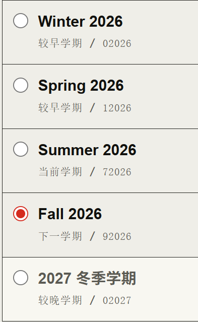

# RC Iteration Round 4 最终讨论与产品/技术设计决策记录

## 文档控制

| 字段 | 值 |
|---|---|
| Record ID | `RC-ITERATION-ROUND-04-FINAL-DISCUSSION-AND-DESIGN-2026-07-17-001` |
| 文档状态 | `DISCUSSION_AND_DESIGN_FINAL` |
| RC I Round 4 状态 | `NOT_STARTED` |
| Round 4 实现授权 | `FALSE` |
| Release 授权 | `FALSE` |
| 生产部署授权 | `FALSE` |
| 历史记录中的 RC3 基线分支 | `codex/p7-implementation` |
| 历史记录中的 RC3 基线提交 | `dfabbfdcbea0cb90021ed59d11ccb38c29b19fa7` |
| 当前活动工作区 Git | 用户恢复后重新 `git init`：`master` / 0 commits / 0 remotes；见 §3.5、§4.10 |
| HumanTest 输入 | RC3 最终 Windows ZIP |
| HumanTest ZIP SHA-256 | `96f32f31813bcf5950dbcec7722203072d462a5fbcfb0cda4f50e18c8fdee853` |
| 讨论冻结日期 | `2026-07-17` |
| 时区 | `Asia/Shanghai`（用户讨论）/ `America/New_York`（Rutgers 学期判定） |
| 本次落盘执行模式 | `LOCAL_ONLY_DOCUMENTATION` |
| 远端上传、提交、推送 | `NOT_AUTHORIZED / NOT_PERFORMED` |

> **状态声明**：本文完成的是 Round 4 开始前的最终讨论、事实调查、产品裁决与设计冻结。它不表示 Round 4 已经开始；本次只允许本地文档落盘，不授权修改产品代码、构包、创建本轮提交，亦不授权任何远端上传、提交、push、PR、远端 CI/构建、GitHub Release、Vultr、DNS、证书或生产部署。用户随后明确宣布开始 Round 4 时，也只开启本文定义的本地实施与验证；远端动作仍须另行、明确授权。

---

## 1. 文档目的与权威范围

本文将以下内容收敛为一份可以直接接续实施的 Round 4 设计基线：

1. RC I 产生环境、目的及 Round 1–3 的继承关系；
2. Round 3 最终 Windows 候选的最新真实 HumanTest；
3. HumanTest 后从“我已经完成了人类测试……”到当前为止的调查、纠偏与最终裁决；
4. Round 4 必须重做的 Round 3 UI/UX；
5. 学期、Campus、查询范围、按钮、筛选语义、数据库性能及并发设计；
6. 明确 supersede 的 RC3 合同、继续保留的不变量、验收标准和非目标；
7. 正式开轮后必须执行的 UI 两阶段、本地实现与验证，以及当前明确延后的远端/双包动作。

本文不是对历史记录的覆盖性改写。历史文档继续保留当时真实决定；本文只对“Round 4 应如何设计”作最终裁决。

### 1.1 本次完整读取的权威输入

四份 chatlog 均已从头到尾读取：

1. [`chat-log-codex-2026-07-12-56fa8f10.md`](../../../chat-log-codex-2026-07-12-56fa8f10.md)，2,114 行；
2. [`chat-log-codex-2026-07-13-86c5b28a-1.md`](../../../chat-log-codex-2026-07-13-86c5b28a-1.md)，4,418 行；
3. [`chat-log-codex-2026-07-16-05afa573.md`](../../../chat-log-codex-2026-07-16-05afa573.md)，2,241 行；
4. [`chat-log-codex-2026-07-16-6c08e851.md`](../../../chat-log-codex-2026-07-16-6c08e851.md)，5,561 行。

同时完整读取：

5. [`01-project-history-context-and-timeline-through-rc3.md`](./01-project-history-context-and-timeline-through-rc3.md)；
6. [`02-rc-iteration-authoritative-model-and-round-04-handoff.md`](./02-rc-iteration-authoritative-model-and-round-04-handoff.md)。

Round 3 原始产品与技术决策的补充证据为：

7. [`00-rc-iteration-round-03-product-and-technical-design-decision-record.md`](./00-rc-iteration-round-03-product-and-technical-design-decision-record.md)。

### 1.2 冲突时的权威顺序

本文沿用 RC I 权威模型，并将本次讨论纳入最顶层：

1. 当前用户对 Round 4 的最新明确裁决；
2. 当前真实 HumanTest 原文、图片与 HumanTest 数据库；
3. 本文第 5–10 节冻结的最终设计；其中用户直接裁决、设计推导和测量后选择分别按 `USER_DECIDED / DESIGN_DERIVED / MEASUREMENT_CONDITIONED` 标记和解释；
4. Rutgers 官方日历、SOC 官方代码和当前公开数据；
5. RC3 当前实现、源码、测试、Git 和制品；
6. RC3 决策记录与截至 RC3 的权威模型；
7. Round 1/2、P7/P7.5 等较早历史合同；
8. 旧 PASS、旧包、中间 amend SHA 和助手未获用户确认的推断。

### 1.3 证据标签

本文使用：

- `OBSERVED`：HumanTest、截图、数据库或运行记录直接证明；
- `CODE_CONFIRMED`：当前源码直接证明；
- `OFFICIAL_CONFIRMED`：Rutgers 官方资料直接证明；
- `INFERRED`：证据高度吻合，但仍需正式 Round 的受控复现；
- `USER_DECIDED`：用户在本轮讨论中直接提出或最终裁决；
- `DESIGN_DERIVED`：为实现 `USER_DECIDED` 产品行为而形成的技术设计，不冒充用户原句；
- `MEASUREMENT_CONDITIONED`：必须先取得 Round 4 真实基线，随后才能在冻结边界内选择的实现路径；
- `SUPERSEDED`：旧合同被本次更晚决定明确替代；
- `NOT_STARTED`：设计已冻结但尚未实施。

---

## 2. RC I 的产生环境、目的和 Round 1–3

### 2.1 上游环境

RC I 不是孤立出现的“第四次改版”。它产生于以下产品和交付环境：

- 严格两个产品包：Windows Local 一键包与 Linux Public 服务包；
- 一套 Rust 共享核心、一套 React WebUI、SQLite、Catalog/Open、query、watch 与 WebSocket；
- Local/Public 共享课程发现和筛选，Local 额外拥有 Saved Views、History、Settings、Reset 等能力；
- Linux 部署是使用 Public 包的后续动作，不是第三个产品；
- Release 与生产部署始终需要独立授权。

2026-07-12 的历史首先冻结了产品目的：改善原 Rutgers CSP “筛选少、性能低、难以找到想要的课程”的体验；搜索以 Course 为中心，同时保留 Section 条件、详情、直链和 watch。筛选的持续底层语义是：不同字段 AND、同字段多选通常 OR、全部 Section 条件必须由同一个 Section 满足，证据不足不得伪造成确定匹配。

### 2.2 UI 强制两阶段的历史来源

UI 两阶段不是 Round 4 新加的审美偏好。

P7 时用户明确要求：

> “不是先做好包再做 UI。”

> “UI的编写（使用2个SKILLS）和UI的打磨（使用一个SKILLS），需要是两个不同的任务、记录和提交。”

历史位置：`chat-log-codex-2026-07-13-86c5b28a-1.md:404-416`。

当时形成：

```text
P7.2：industrial-brutalist-ui + design-taste-frontend
→ 正式结构、视觉、响应式、状态和可访问性

P7.3：emil-design-eng
→ 基于真实实现形成 Before | After | Why
→ 落实打磨
→ 浏览器、键盘、axe、对比度和性能复验
```

进入 RC Iteration 后，用户又纠正了 P7 的逐任务提交方式：两阶段仍必须真实执行并留下证据，但属于同一 Round 的内部步骤；整轮最终只保留一个提交和一个候选身份。

### 2.3 为什么 P7.5 之后产生 RC Iteration

P7.5 原本假设候选包已经冻结，只需在真实 Windows、Linux 与 Vultr 中消费同一候选并形成最终 E2E 证据。但用户两次用真实使用推翻了旧 PASS：

1. “下载包 → 解压 → 运行 → 正常使用”的标准用户路径无法正常搜索；
2. 修复并再次 PASS 后，精确候选仍被发现存在服务状态、空间利用、学分、Section 默认展开和 Core Code 等产品问题。

用户随后要求停止重复完整 E2E 证明循环，改为：

> “使用-发现问题-进行更改-再次打包”

历史位置：`chat-log-codex-2026-07-16-05afa573.md:1202-1208`。

由此形成 RC Iteration：位于 P7/P7.5 之后、Release 之前；以真实 HumanTest 为最高运行证据；一轮汇总一批问题、定向修改、Windows 优先验证、整轮一个最终提交、同 SHA 生成双包，再交回下一轮 HumanTest。

### 2.4 Round 1

```text
baseline: 32c1d72a510d0daf2b88762cccfb10287c9ec103
final:    bb9700c3587baf3bb29db9b549602d8d1661a502
```

输入是 HumanTest 发现的五项问题：状态不可见、超宽屏空间浪费、学分筛选错误、Sections 默认全部展开、Core Code 只能手填。

持续成果：

- Service Status V1；
- 学分解析与 `NO_MATCH` 裁剪；
- Core 动态字典；
- 全宽高效布局；
- Sections 默认收起；
- SQLite 状态查询与 personal mutation 锁修复；
- RC 构包流程。

Round 1 留下了清晰的两阶段合规证据：先完成 `industrial-brutalist-ui + design-taste-frontend`，再明确进入 `emil-design-eng`，形成真实 `Before | After | Why` 表、落实修正并做多视口复验。这是 Round 4 的执行范本。

### 2.5 Round 2

```text
baseline: bb9700c3587baf3bb29db9b549602d8d1661a502
final:    fd0f91bfe8e01616f94cd87cc2ffdcb737812e49
```

输入是 RC1 后的十二项 HumanTest，覆盖状态文案、空间、课程/Section 信息架构、筛选字段、动态字典、SearchSession、声音、技术文案和 sticky 导航。

持续成果：

- 单一课程工作区；
- Query Contract V2 / 18 字段；
- 动态字典；
- SearchSession；
- sticky navigation；
- 用户语言状态；
- 加入 watch 列表与 START 分离；
- START 前音频解锁；
- FTS、外键索引、合法空 Open 等修复。

已被 RC3 推翻的 Round 2 合同是“9 学期 × 15 Campus、Catalog 135/135 且 Open 135/135 才开放整个搜索”。真实 HumanTest 证明一个慢 target 会误触发全局 fatal circuit，停止余下所有拉取。

### 2.6 Round 3

```text
baseline: fd0f91bfe8e01616f94cd87cc2ffdcb737812e49
final:    dfabbfdcbea0cb90021ed59d11ccb38c29b19fa7
```

Round 3 回到简单数据链：

```text
获取原始 JSON
→ 解析
→ 规范化
→ Catalog + Open 完整快照原子写库
```

其持续成果包括：

- `America/New_York` 与 Rutgers 实际教学日历；
- Public current + next；Local 前二 + 当前 + 后二；
- current + next 自动拉取；Local 另外三个学期手动拉取；
- ONLINE aliases 不作为独立 Campus；
- READY 粒度为 `(term, real campus)`；
- Catalog + Open 为不可拆分的完整原子快照；
- selected-target 查询门禁；
- 最多三个 target 工作流；
- target 级错误与真实 retry；
- LKG、Fast Lane、watch 范围；
- candidate scope 与 applied scope 分离；
- QueryScopeControl 和筛选折叠定位。

Round 3 最终制品：

- Windows SHA-256：`96f32f31813bcf5950dbcec7722203072d462a5fbcfb0cda4f50e18c8fdee853`；
- Linux SHA-256：`93414a6e55f38e17983582f5e4e67f8367d6a385de079405040a101645afbd9a`；
- Linux workflow：`29539206886`，attempt 1，success；
- 未 Release，未部署。

### 2.7 Round 3 的 UI 两阶段缺口

Round 3 计划中写明会执行两阶段，也记录了 Skills 已读和第一阶段开始；但从其后执行到最终交付，没有与 Round 1 等价的以下证据链：

```text
第一阶段真实成果
→ 明确进入 Emil 第二阶段
→ 基于真实实现的 Before | After | Why
→ 逐项落实
→ 落实后的浏览器/键盘/响应式复验
```

用户当前 HumanTest 明确裁决“Round 3 并没有按照 UI 强制两阶段来工作”。依据证据优先级，该裁决高于 Round 3 最终报告中的旧自报。Round 4 不仅要对自身 UI 修改走两阶段，还必须重做 Round 3 涉及的画面和 UI/UX。

---

## 3. 当前 Round 4 HumanTest 原始输入

以下保留用户原文；只将截图从系统临时目录复制为稳定资产，不改写文字、不修改图片字节。

```text
我已经完成了人类测试，以下是发现的问题以及需要修改的地方：
1.首先，Round 3并没有按照UI 强制两阶段来工作，所以Round 4不仅在自己轮次内所有涉及到画面、UIUX的修改都要严格按照UI 强制两阶段来工作，还需要重做Round 3中涉及到画面、UIUX的修改。在重做过程中，请严格参考历史记录。
2.按照我们的约定，默认拉取的两个学期是当前学期（目前是夏季）以及下一个学期（秋季），其他学期在没有拉取数据之前以灰色显示，但是如图1所示，当前开启服务Winter 2026以及 Spring 2026皆以正显显示，只有2027 冬季学期是以灰色显示，并且就算选定了2027冬季学期，拉取按钮也是灰色不能使用的。除此之外还有三个问题，1是为什么2027 冬季学期是中文？2是你对学期的命名我觉得有问题，按照我的理解，应该是2026年春季 2026年夏季 2026年秋季 2026年冬季，当前的排序之间从2026年冬季-2026年春季-2026年夏季-2026年秋季-2027年冬季进行的排序。我希望你对第二个问题进行实际的调查。3是按照我们Round 3的讨论，按钮应该显示当前的状态：已应用。
3.我建议我们不要支持这么多校区，建议只支持3个（如果我记的没错的话）主校区，即NB NK CM，然后把查询范围和建立精确搜索这两个方框（如图2图3所示）删除，只保留应用和搜索两个按钮，把这两个按钮和3个校区放在一列，和前2后2五个时间学期形成2列5行的格局，这样更美观，也减少了大量空间的浪费。
4.如图4，我建议直接删除这两个黑框，所有筛选条件默认展开。这样减少了各种展开的对齐逻辑要求，也让筛选栏更为直观。

接下来是筛选栏的修改：
1.把05 课程编号功能删除，替换为根据课程级别，这里的课程级别是指100级别的课，200级别的课，400级别的课。
2.如图5所示，不应该出现这样的突兀的滑动条，要么隐藏要么用同一风格的代替。
3.对于有筛选作用的，在没有选择的情况下应该默认最宽松的。比如06 课程级别如果没有选择U或者是G，则默认U和G的课程都会出现；09 是否有先修要求，如果不选择默认任意。这个规则适用于所有的筛选条件。
4.我建09的选项改成：有先修要求/无先修要求 然后一个完整数据显示，开启这个完整数据显示的话会把这些没用数据的课程加进去，比如当前我勾选了无先修要求并且勾选了完整数据显示，这两个课我会一起看到。13/12的选项也这样改，13改成：同步/异步/混合/完整数据显示；12改成：线下/在线/混合/完整数据显示。原因是普通筛选界面不应该直接展示如此技术性的分类，而且这两者都不是应该存在的“筛选条件”。
5.还是那个事情，Round 3没有按照UI 强制两阶段来工作，而Round 3大幅度的修改了搜索筛选栏，所有请在进行Round 4修改的时候，给Round 3擦屁股。请在一阶段使用 industrial-brutalist-ui + design-taste-frontend 完成结构、功能、响应式和可访问性。在二阶段使用 emil-design-eng 形成并落实 Before | After | Why 复核。可以考虑使用 redesign-existing-projects 来“擦屁股”。

一些可能存在的问题：
1.数据库的性能可能有问题，在面临多筛选条件下需要等待非常长的时间，而且我也怀疑如果在更新数据的时候进行筛选搜索，很可能会卡住。

我已经完成了人类测试，再有其他问题我会告知。（本输出不意味着RC I Round 4正式开始）具体记录、讨论请你参考：[完整历史、上下文与时间线（截至 RC3）](/Z:/Project/Rutgers-BetterCourseSchedulePlanner/project-governance/current/rc-iteration/01-project-history-context-and-timeline-through-rc3.md)以及[RC Iteration 权威模型与 Round 4 接续记录](/Z:/Project/Rutgers-BetterCourseSchedulePlanner/project-governance/current/rc-iteration/02-rc-iteration-authoritative-model-and-round-04-handoff.md)
```

### 图 1：五学期状态、命名和语言不一致



### 图 2：查询范围大型方框


### 图 3：建立精确搜索大型方框


### 图 4：03–09 / 10–18 黑色折叠框


### 图 5：嵌套且风格突兀的滚动条


### 3.1 最终补充裁决原文

用户在只读调查之后完成最后两个待定项：

```text
1.只显示前2后2的学期，不能拉取的“拉取”按钮就显示不可用
2.动态显示全部实际号段
```

本文将其精确解释为：

- Local 始终只显示“前二 + 当前 + 后二”，共五个学期；不会扩展为任意年份或第六个学期；
- 五学期窗口内如果 Rutgers 尚未发布、因而不能拉取，仍显示该学期；上下文动作保持“拉取”，但为不可用状态，并在按钮外说明原因；
- 05 不固定为 100/200/400，而是从当前 applied targets 的真实课程数据中动态生成全部实际存在的百位号段。

### 3.2 从 HumanTest 到本文的讨论时间线

1. 用户首次提交同一批 HumanTest 问题和五张截图；
2. 用户再次提交权威版本，明确补充“本输出不意味着 RC I Round 4 正式开始”；
3. 用户指定 `01/02` 为具体记录与讨论依据；
4. Codex 在未修改代码的前提下调查 Rutgers 官方学期、HumanTest SQLite、当前源码、筛选三值语义和数据库锁；
5. 调查确认学期排序正确，但灰显信号和中英文标签来源错误；确认 Winter 2027 合法但尚未发布；确认 NB/NK/CM 为三个主校区；确认搜索/更新锁竞争风险有真实代码依据；
6. Codex 将仅剩的两个产品选择题交回用户：不可拉取未来 term 的按钮行为，以及 05 号段范围；
7. 用户最终裁决：不可拉取时保留 disabled `拉取`；05 动态显示全部实际号段；
8. 用户要求基于四份 chatlog、`01/02` 和本次完整讨论落盘本文；
9. 在文档复核期间，用户继续裁决：“虽然2×5 只属于 Local，但公网使用应该是一样的”。这冻结了 Local/Public 的共享 QueryScope 组件与交互合同；
10. 用户随后逐格冻结最终桌面几何：Local 严格 `2×5`；Public 严格 `2×3` 主矩阵 + 一行通栏 Search；Public 只显示 current + next、不补空 term、无手动 Pull；
11. 用户在最终交付前再次合并确认上述布局与共享行为，并增加本轮执行边界：“本轮不做远端相关的上传、提交。”；
12. 用户解释远端禁令来自一次错误分支线程，并确认旧 `.git`/`.ngagent` 已永久删除、当前项目已重新 `git init`；当前文件与 `01/02/03` 是继续工作的权威起点。

前两次 HumanTest 上传使用了两组不同临时文件名，但五张图片逐图字节数和 SHA-256 完全相同。本文以本节原文和 `assets/round-04-human-test/` 中的稳定副本为权威输入。

### 3.3 Local `2×5` 与 Public “使用一样”的最终裁决

用户原文：

> “虽然2×5 只属于 Local，但公网使用应该是一样的，你能理解吗？”

用户随后进一步逐格冻结，原文为：

```text
1.Local 桌面布局：采用严格的 2 列 × 5 行 矩阵。左列依次显示前二、当前、后二共五个学期；右列依次显示 NB、NK、CM、应用 / 已应用 和 搜索。Public 桌面布局：采用 2 列 × 3 行主矩阵 + 1 行通栏搜索按钮。第一行为 当前学期 | NB，第二行为 下一学期 | NK，第三行为 CM | 应用 / 已应用；搜索位于矩阵底部并横跨两列。两者共享同一 QueryScope 组件、选择逻辑、应用状态和搜索流程，仅根据实际学期数量调整排列。Public 不补造空学期，也不提供手动拉取功能。
```

本文据此冻结：

- “一样”首先是产品行为和组件合同相同，而不是强迫两种产品拥有相同数量的学期或相同能力；
- Local 在桌面端精确落为五个 term 对三 Campus + Apply/Search 的 `2×5`；
- Public 精确落为 `2×3` 主矩阵加一行横跨两列的 Search；
- Public 不渲染占位 term，不拥有 Pull DOM/API/capability，也不出现 Saved View、History、Settings 等 Local-only 表面；
- 两种产品的状态机、`应用 / 已应用`、Search gate、视觉、键盘、响应式和可访问性必须一致。

该解释标记为 `USER_DECIDED`，并控制本文所有 Local/Public 相关条款。

### 3.4 最终复核原文与本轮执行边界

用户在本文最终复核时的完整原文为：

```text
1.Local 桌面布局：采用严格的 2 列 × 5 行 矩阵。左列依次显示前二、当前、后二共五个学期；右列依次显示 NB、NK、CM、应用 / 已应用 和 搜索。Public 桌面布局：采用 2 列 × 3 行主矩阵 + 1 行通栏搜索按钮。第一行为 当前学期 | NB，第二行为 下一学期 | NK，第三行为 CM | 应用 / 已应用；搜索位于矩阵底部并横跨两列。两者共享同一 QueryScope 组件、选择逻辑、应用状态和搜索流程，仅根据实际学期数量调整排列。Public 不补造空学期，也不提供手动拉取功能。虽然2×5 只属于 Local，但公网使用应该是一样的，你能理解吗？
2.本轮不做远端相关的上传、提交。
```

本文据此作唯一解释：

- “公网使用应该是一样的”指同一 QueryScope 组件、选择/应用/Search 状态机、操作语义、视觉语言、键盘行为、响应式原则和可访问性；它不表示 Public 复制 Local 的 `2×5` 像素几何、五个 term 或手动 Pull；
- Local 与 Public 必须共享行为实现，不得演化出两套相似但不同步的交互逻辑；仅允许依据产品 capability 与实际 term 数量选择 §5.5 冻结的两个布局分支；
- 本次交付仅修改本文及其本地治理资产；没有产品代码修改、构包、commit、上传或 push；
- 正式开始 Round 4 后，当前授权边界仍停在本地实现、本地验证和本地候选交付。push、PR、GitHub/远端上传、远端 CI、Linux 远端构建及部署均不因“开始 Round 4”而自动获权；
- 历史上的“同一源码、Windows Local + Linux Public 两种产品”架构原则继续成立，但其远端实现步骤暂缓，只有用户之后单独明确授权才可执行。

### 3.5 错误线程、NGAT 与空 Git 的恢复裁决

用户在本文最终复核期间补充的完整原文为：

```text
这就是为什么我说不要推送的原因：
当前线程是从一次错误的线程中分出来的。Codex 曾误把旧 Git 历史里的 `AGENTS.md` 当成现行指令，错误启动了 NGAT，但没有完成任何 RC I Round 4 产品改动，也没有推送、发布或部署。为彻底恢复，旧 `.git` 和 `.ngagent` 已永久删除；01/02/03 及五张 HumanTest 图片已确认完整。当前项目已重新执行 `git init`，是全新空 Git：`master`、0 个提交、0 个远端。请直接以当前文件和 01/02/03 为准继续。
```

这段裁决消除了“是否需要找回旧 Git”的不确定性，并冻结以下事实：

- 错误线程和误启动 NGAT 不属于 RC I Round 4 实施；它没有完成任何 Round 4 产品改动；
- 没有由该错误线程产生的 push、Release 或部署需要接续；
- 旧 `.git` 与 `.ngagent` 的删除是用户为恢复项目而完成的有意操作，不得回滚、重建或从旧历史恢复；
- 当前重新初始化的空 Git 与当前文件树是新的操作起点；`01/02/03` 及五张 HumanTest 图片是治理与 HumanTest 权威资产；
- 历史 `dfabbfd…` 只用于解释 RC3 来源、旧制品和可比基线，不是当前仓库必须拥有的 commit object；
- 任何旧 Git 历史里的 `AGENTS.md` 都不是现行指令，也不得据此恢复或继续 NGAT；现行工作只服从当前用户指令、当前会话系统/开发者规则和当前文件。

本文落盘时又以只读方式确认：当前 branch=`master`、commit count=`0`、remote count=`0`、`.ngagent` 不存在，当前文件树中也不存在 `AGENTS.md`。

### 3.6 当前讨论的终点

截至本文落盘，产品问题与设计决策已经对齐，没有剩余产品选择题。当前只缺少一项授权：用户尚未宣布正式开始 RC I Round 4。即使该授权之后给出，也不包含任何远端动作。

---

## 4. 只读调查事实与根因

### 4.1 学期灰显使用了错误信号

`OBSERVED`：HumanTest 数据库中，只有 Summer 2026 / `72026` 与 Fall 2026 / `92026` 存在实际 target 状态；Winter 2026 与 Spring 2026 仅存在于 discovery，没有本地完整快照。

`CODE_CONFIRMED`：当前 UI 用 `term.discovered` 决定学期是否灰显，而不是使用本地完整 Snapshot READY。位置：

- `frontend/src/ui/shared/search/QueryScopeControl.tsx:254`；
- `crates/bcsp-application/src/service_status.rs` 的 term discovery/status 构造。

所以 Winter/Spring 因为“Rutgers discovery 曾发现”而正显，即使从未在当前 fresh HumanTest 中拉取。这与 Round 3 的“未拉取灰色”合同冲突。

### 4.2 中英混排来自两套标签来源

`CODE_CONFIRMED`：

- discovery 中已有的 term 使用 Rutgers 英文 `termLabel`；
- discovery 中没有的 term 使用本地 i18n fallback；
- 位置：`frontend/src/ui/shared/search/QueryScopeControl.tsx:185`。

因此前四项显示英文，未发布的 `02027` 显示中文。这不是 Rutgers 特殊命名，而是本地格式化不一致。

### 4.3 Winter 的官方年份和排序

`OFFICIAL_CONFIRMED`：Rutgers SOC 官方代码定义：

```text
0 = Winter
1 = Spring
7 = Summer
9 = Fall
```

因此：

| Term ID | 官方学期 |
|---|---|
| `02026` | Winter 2026 |
| `12026` | Spring 2026 |
| `72026` | Summer 2026 |
| `92026` | Fall 2026 |
| `02027` | Winter 2027 |

官方证据：

- [Rutgers SOC `soc_utils.js`](https://classes.rutgers.edu/soc/js/soc_utils.js?v=2026-04-07)；
- [Winter Session 2026 Important Dates](https://summerwinter.rutgers.edu/winter-session/important-dates)；
- [Rutgers Academic Calendar](https://scheduling.rutgers.edu/academic-calendar/)。

Rutgers 的 Winter 按结束所在年份命名：Winter 2026 为 2025-12-22 至 2026-01-16；2026 年 12 月至 2027 年 1 月的学期叫 Winter 2027。因此真实时间正序必须是：

```text
Winter 2026
→ Spring 2026
→ Summer 2026
→ Fall 2026
→ Winter 2027
```

图 1 的排序正确；问题在语言和状态，不在排序。

### 4.4 当前和下一学期

`OFFICIAL_CONFIRMED`：在 2026-07-17，Summer 2026 仍在授课，Fall 2026 尚未开始，因此：

```text
current = Summer 2026 / 72026
next    = Fall 2026 / 92026
```

不能用“Rutgers SOC 最新已发布 Fall”替代教学日历中的当前学期。

### 4.5 Winter 2027 尚不可拉取

`OFFICIAL_CONFIRMED`：Winter 2027 是真实未来学期，但截至 2026-07-17 尚未进入 Rutgers SOC 选择器。Rutgers 的 Winter Schedule 通常于 9 月 1 日 / Fall 第一天发布；NB/NK/CM 的 `courses.json` 与 `openSections.json` 当前返回空数组。

证据：

- [SOC Production Calendar](https://scheduling.rutgers.edu/course-scheduling/schedule-of-classes-production-calendar/)；
- [Winter 2027 NB courses](https://classes.rutgers.edu/soc/api/courses.json?year=2027&term=0&campus=NB)；
- [Winter 2027 NK courses](https://classes.rutgers.edu/soc/api/courses.json?year=2027&term=0&campus=NK)；
- [Winter 2027 CM courses](https://classes.rutgers.edu/soc/api/courses.json?year=2027&term=0&campus=CM)。

`CODE_CONFIRMED`：Local 手动 Pull 目前要求 `term.discovered === true`，位置 `frontend/src/ui/local/LocalTermPullAction.tsx:33`；后端同样拒绝未发布 target。

所以不能拉取本身有官方依据；当前缺陷是“无解释的灰色禁用”和状态混用。

### 4.6 三个主校区

`OFFICIAL_CONFIRMED`：Rutgers 有三个 main regional locations：New Brunswick、Newark、Camden；SOC 官方代码定义 `CAMPUSES_MAIN = "NB,NK,CM"`。

证据：

- [Rutgers Structure](https://www.rutgers.edu/about/structure)；
- [Rutgers University Campuses](https://discover-uhr.rutgers.edu/jobs/working-rutgers/rutgers-university-campuses)；
- [Rutgers SOC `soc_utils.js`](https://classes.rutgers.edu/soc/js/soc_utils.js?v=2026-04-07)。

Round 3 当时只移除了 `ONLINE_NB/NK/CM` aliases，仍动态支持 12 个真实 Campus；“只支持 NB/NK/CM”是本次 Round 4 的新产品裁决，不是 Round 3 的原要求。

### 4.7 嵌套滚动条和折叠框

`CODE_CONFIRMED`：

- 外层 filter rail 使用 `overflow: auto`；
- subject 和 dictionary options 又使用 `max-height + overflow: auto`；
- 位置：`frontend/src/ui/shared/search/searchStyles.tsx:27`、`frontend/src/ui/shared/search/filters/FilterPanel.tsx:789-797`；
- 两个黑框来自 `frontend/src/ui/shared/search/filters/FilterPanel.tsx:1356` 和 `:1372` 的 `<details>`。

图 5 是多个嵌套滚动容器的真实结果。P7.5 还曾发生测试脚本误将已经展开的 Section constraints 折叠，随后找不到隐藏控件。这为删除折叠复杂度提供了历史实证。

### 4.8 “完整数据显示”当前隐式常开

`CODE_CONFIRMED`：查询内核使用 `MATCH / NO_MATCH / UNCERTAIN`；课程候选只排除 `NO_MATCH`，`UNCERTAIN` 默认仍进入可见结果。位置：`crates/bcsp-query/src/engine.rs:123-145`。

因此当用户选择“无先修要求”“线下”或“同步”等确定选项时，缺失、冲突或未知记录仍可能通过 `UNCERTAIN` 出现在结果中。当前效果相当于“完整数据显示”隐式常开，而 UI 又把 `OTHER / UNKNOWN / UNSPECIFIED` 暴露为普通筛选选项。

### 4.9 数据库性能和搜索/更新竞争

`OBSERVED`：用户真实使用多条件搜索等待很久；当前 HumanTest WAL 约 850 MB。RC3 还记录过约 553 MB WAL 和 140.28 秒优雅退出 checkpoint。

`CODE_CONFIRMED`：

- 产品存储为全局 `Arc<Mutex<OperationalStorage>>`：`crates/bcsp-application/src/product_routes.rs:50`；
- route 在 `with_storage` 中持锁执行整个操作：同文件 `:592-604`；
- 每次搜索、filter options 和动态值校验都会调用 `load_catalogs`，重新从 SQLite 投影所有所选 targets：`crates/bcsp-application/src/query_service.rs:95-160, 234-260, 367-385`；
- QueryEngine 遍历 course groups、variants、sections，再对全部候选排序：`crates/bcsp-query/src/engine.rs:99-150`。

历史上已经出现过两类相关缺陷：查询持锁后请求同一非重入锁造成自锁；巨型 Catalog 发布把 bootstrap 和页面读取一起堵住。它们曾被定向修复，但当前搜索路径仍在全局 product mutex 下做完整投影和扫描。

`INFERRED`：复杂搜索和后台更新会竞争同一存储锁，可能互相排队并表现为“卡住”。这不是已完成的并发复现；Round 4 必须用当前 HumanTest 规模做受控并发测试。

### 4.10 当前空 Git 是用户确认的恢复后权威起点

`USER_DECIDED + OBSERVED`：当前 Git 状态不是待修复的历史丢失，而是用户为清除错误线程/NGAT 影响而主动完成的恢复结果：

```text
branch: master
commit count: 0
remote count: 0
.ngagent: absent
AGENTS.md in current tree: absent
historical dfabbfdcbea0cb90021ed59d11ccb38c29b19fa7 commit object: absent by design
current files + 01/02/03 + five HumanTest images: authoritative continuation baseline
```

因此：

1. 不寻找、不恢复、不重新连接旧 `.git` 或 `.ngagent`；
2. 不从旧 Git 历史读取或执行 `AGENTS.md`，不继续 NGAT；
3. `codex/p7-implementation` 与 `dfabbfd…` 只作为 chatlog、`01/02`、RC3 决策记录和既有制品中的**历史 RC3 证据身份**；
4. 当前文件树直接作为 Round 4 的源码基线；`01/02/03` 和五张稳定 HumanTest 图片控制治理与设计解释；
5. 正式开轮时只需对当前树生成可审计 baseline manifest/hash、冻结 write allowlist 和本地 Git 策略，不需要用户再次回答“是否恢复旧历史”；
6. 当前空 Git 不能成为 push 理由；本轮远端上传、提交、push 仍明确禁止。

这项裁决解决了先前版本本文提出的“恢复/查找历史”阻塞，不改变 `RC I Round 4 = NOT_STARTED`。

---

## 5. Round 4 最终产品设计

本节是 Round 4 的最终设计基线，但实现状态仍为 `NOT_STARTED`。用户直接裁决标记为 `USER_DECIDED`；为使这些行为可实现而补全的 wire、迁移和一致性规则属于 `DESIGN_DERIVED`；性能方案中需要真实基线后才能选择的部分属于 `MEASUREMENT_CONDITIONED`。三者均进入本文，但后两者不冒充用户逐字原话。

### 5.1 UI 强制两阶段

#### 第一阶段：结构、功能、响应式、可访问性

第一阶段必须共同使用：

- `industrial-brutalist-ui`；
- `design-taste-frontend`。

`redesign-existing-projects` 是用户提出的可选既有项目审计辅助，而不是强制 Skill。若正式实施时决定使用，必须记录它如何帮助识别和清理 RC3 UI 问题；不得借此重写技术栈或扩大范围。

第一阶段必须覆盖：

- 本文全部新 UI；
- Round 3 改动过的 QueryScopeControl、term/campus、Pull/Apply、Search、filter rail、筛选项、折叠/滚动、状态和错误；
- Local/Public 共享和变体边界；
- 桌面、窄屏、移动端；
- 键盘、焦点、可访问名称、对比度、非颜色状态表达；
- loading、empty、error、unpublished、unpulled、pulling、READY、LKG、retry、applied。

视觉语言继续使用 Swiss Industrial Print：纸色/黑/白/单一红色、硬网格、高信息密度、无渐变、无重阴影、无圆角卡片、无装饰图形、无新 UI/动画/图标依赖。

#### 第二阶段：真实实现复核和落实

第一阶段真实集成并完成浏览器验证后，必须明确进入 `emil-design-eng`：

1. 针对真实 Before 状态和真实 After 实现形成 Markdown 表：

   ```text
   | Before | After | Why |
   ```

2. 复核并立即落实按钮、loading、错误、焦点、滚动、触控、键盘、响应式、reduced-motion；
3. 再次执行多视口和键盘/无障碍验证；
4. 第二阶段不得扩大本文冻结的功能范围；
5. 两阶段同属 Round 4，最终只保留一个 Round 4 提交和一个候选身份。

### 5.2 Local 五学期窗口与 Public 两学期窗口

`USER_DECIDED`：Local 始终显示：

```text
previous 2 + current + next 2 = 5 terms
```

在 2026-07-17，确定顺序和名称为：

1. `2026年冬季` / `02026` / 较早学期；
2. `2026年春季` / `12026` / 较早学期；
3. `2026年夏季` / `72026` / 当前学期；
4. `2026年秋季` / `92026` / 下一学期；
5. `2027年冬季` / `02027` / 较晚学期。

规则：

- 使用 `America/New_York` 与官方教学日期决定 current/next；
- 当前语言为中文时全部名称由本地确定性格式化生成，不混用 upstream 英文 raw label；英文界面同理统一为英文；
- term ID 始终作为字符串保存，保留 Winter 的前导 `0`；
- 只显示这五个，不增加第六个、任意年份或无限历史选择器；
- current + next 自动首次拉取；
- 另外三个只在用户明确触发时手动拉取；
- 手动拉取成功不自动 Apply；
- Public 继续只显示 current + next，且无手动 Pull；这只是内容和 capability 差异，不改变 §5.5 冻结的共享使用方式。

### 5.3 学期状态机和上下文动作按钮

`DESIGN_DERIVED`：学期发布状态、每个 `(term, campus)` 的 Snapshot 状态、candidate scope、applied scope 必须分层计算，不能再用一个 term-level 布尔值代替。READY 的权威粒度始终是 `(term, campus)`。

#### 5.3.1 四层状态

1. **发布层**：term 是否位于产品窗口；Rutgers 发布状态为 `PUBLISHED / UNPUBLISHED / UNKNOWN`。空 API 不等于已发布；`UNKNOWN` 与 `UNPUBLISHED` 都不开放手动 Pull，但必须分别说明“发布状态尚未确认”或“Rutgers 尚未发布”。
2. **target 数据层**：读取既有 `ServiceStatusV2` raw wire：`snapshotAvailability = UNREQUESTED / NO_COMPLETE_SNAPSHOT / READY`、`workState = IDLE / QUEUED / RUNNING / RETRY_WAIT`，以及 `usable / nextRetryAt / error`。本文中的 `NONE / READY / LKG / TERMINAL_FAILED / ACTIVE_WORK` 只是 UI/action resolver 的派生语义，不新增 wire enum、不隐式升级 Service Status contract。
3. **候选层**：一个 candidate term 与零到三个 candidate campuses；fresh session 为 current term、campuses=`[]`。
4. **应用层**：当前真正供 Search 使用的 applied term + campuses；编辑 candidate 不改变 applied。

发布层的唯一权威信号是最近一次成功验证并原子发布的 Rutgers SOC discovery document，不使用单次空 `courses.json/openSections.json` 响应推断发布。映射与新鲜度冻结为：

- discovery 成功时间距当前不超过既有 `DISCOVERY_REFRESH_INTERVAL = 6h`，且包含该 term 的任一 NB/NK/CM target：`PUBLISHED`；
- 同样新鲜的成功 discovery 明确不含该 term 的任何 NB/NK/CM target：`UNPUBLISHED`；
- 尚无成功 discovery、最近成功记录已超过 6h 或证据冲突：`UNKNOWN`；最近 transport/decode/schema 失败作为原因显示，但不会在 6h 新鲜期内立刻推翻上一成功结果。不得把陈旧“缺席”冒充 `UNPUBLISHED`。

已有 `READY/LKG` 的 target 不会因发布信号暂时变成 `UNKNOWN` 而失去本地可用性；发布层只控制尚无可用数据时能否开始新的 Local 手动 Pull。

target 派生映射冻结为：

- `NONE`：raw `usable=false`；同时保留 `UNREQUESTED / NO_COMPLETE_SNAPSHOT` 以生成精确文案；
- `READY`：raw `usable=true`，且没有最新失败/retry 证据；后台成功数据可与新的 queued/running refresh 同时存在；
- `LKG`：raw `usable=true`，同时存在最新 refresh 失败、scheduled retry 或 terminal failure 证据；
- `TERMINAL_FAILED`：raw `workState=RETRY_WAIT && nextRetryAt=null && error!=null`；
- `ACTIVE_WORK`：raw `workState` 为 `QUEUED / RUNNING`，或 `RETRY_WAIT && nextRetryAt!=null`。

只有完整 Catalog + Open 原子 Snapshot 才能使 raw `usable=true`。后台 workflow 和 error 不得覆盖或抹去已有 usable Snapshot；若以后决定真的增加 `LKG/FAILED` wire enum，必须另行升级 Service Status contract、schema golden 与 Local/Public parser，不能借本文暗改。

#### 5.3.2 学期卡和 Campus 单元

| 可用完整 target 数 | 学期卡视觉 | 必须显示的文本 |
|---:|---|---|
| `0/3` | 灰显，但仍可选择 term | `尚无本地完整数据`，并给出未发布、未拉取、自动拉取中、失败等真实原因 |
| `1/3` 或 `2/3` | 正显 | `部分可用 N/3`，逐 Campus 显示状态 |
| `3/3` | 正显 | `已就绪 3/3` |

- `READY` 与 `LKG` 均计入“可用”；LKG 必须额外显示“使用上次完整数据”和真实 refresh/retry 状态。
- Campus 单元始终只有 NB/NK/CM，并按当前 candidate term 逐 target 同时显示 Snapshot 可用性与后台 workflow；不可用 Campus 不得被加入新的 candidate。恢复的旧会话若含失效值，必须保留并标 invalid，不能静默删除。
- 未选择、失败或仍在拉取的其他 Campus，不得阻止已选择且可用的 target 被 Apply 或 Search。
- 灰色只表达“NB/NK/CM 均无本地完整数据可用”，不得再等同于 discovery；所有状态都必须同时提供文本、可访问名称和焦点表达，不能只靠颜色。

#### 5.3.3 Local 手动 Pull

- 仅 Local 五期窗口中的 previous 2、previous 1 与 next 2 三个 term 具有手动 Pull 路径；current 与 next 1 始终自动维护，永不显示 Pull。
- 手动 Pull 是 **term 级动作**，一次请求集合固定为 `{(term,NB),(term,NK),(term,CM)}`，不要求用户先选择 Campus；调度器逐 target 去重、独立执行、独立 READY/失败，并发仍受“最多三个 target 工作流”约束。
- Pull 成功只改变 target 数据状态，不自动选择 Campus、不自动 Apply、不自动 Search。
- 不出现“继续拉取”“正在拉取”等按钮文案；队列、阶段、进度、retry 与失败原因始终在按钮外。

#### 5.3.4 唯一上下文动作求值顺序

对当前 candidate term，scope 动作单元按以下顺序唯一求值：

其中 `needsPull(target)` 只按既有 raw wire 与上述派生状态求值：

```text
NONE AND (
  raw workState = IDLE
  OR TERMINAL_FAILED
)
```

`ACTIVE_WORK` 不允许重复入队；raw `usable=true` 的 `READY/LKG` 自身不构成 needsPull。term-level Pull 只为同 term 中 `needsPull=true` 的 missing targets 入队，并对 usable 或已有工作的 targets 去重。

1. candidate 含至少一个 Campus，且全部已选 targets 的 raw `usable=true`（派生为 `READY` 或 `LKG`）：
   - candidate 与 applied 完全相同：显示 `已应用`，disabled；
   - candidate 与 applied 不同：显示 `应用`，enabled。
2. Local 手动 term 没有可应用的已选范围，且 `exists(target: needsPull(target))`：
   - `PUBLISHED`：显示 `拉取`，enabled；点击后只入队 needsPull targets，其他 active/usable targets 由后端逐 target 去重；
   - `UNPUBLISHED`：仍显示 `拉取`，disabled，并关联“Rutgers 尚未发布”。Winter 2027 当前属于此项；
   - `UNKNOWN`：仍显示 `拉取`，disabled，并关联“发布状态尚未确认”。
3. Local 手动 term 没有可应用的已选范围、`!exists(needsPull)` 且 `exists(ACTIVE_WORK)`：显示 `拉取`，disabled；真实 target 进度或 `nextRetryAt` 在按钮外。terminal failure 因 `needsPull=true` 会回到第 2 项，不会永久卡在 disabled retry。
4. Local 手动 term 已请求，但 candidate 为空或包含不可用 target：显示 `应用`，disabled，并明确“请选择至少一个可用 Campus”或列出不可用 target。
5. Local current/next 与全部 Public term 永不显示 Pull；若当前不能 Apply，则显示 `应用`，disabled，并在按钮外展示自动拉取、retry、无 Campus 或不可用 target 的原因。

`已应用` 是本次最新用户裁决。它覆盖 RC3 已记录并实现的两文案合同；其中“禁止 `已应用`”并不是 Round 3 用户原句，而是当时的助手派生结论。

#### 5.3.5 Search 与 LKG

- Search 的 enabled 状态只依赖 applied scope 存在且其中每个 target 的 raw `usable=true`（派生为 `READY` 或 `LKG`）；candidate 正在 Pull、失败或未就绪不得冻结仍然有效的 applied Search。
- refresh 失败但有 LKG 时，applied scope 与既有 Search 继续可用；无 LKG 的 selected applied target 才使 Search gate 失败，并必须精确说明 target。

### 5.4 只支持三个主校区

产品支持范围收敛为：

- `NB` — New Brunswick；
- `NK` — Newark；
- `CM` — Camden。

适用层面：

- QueryScopeControl 只显示三者；
- current/next 自动 target 只调度三者；
- Local 手动 Pull 只允许三者；
- 查询、动态字典、SearchSession 和 Saved View 只接受三者；
- watch 仍只允许 current/next，且只接受三者；
- `ONLINE_NB/NK/CM` 不作为独立 Campus；线上课程必须仍可通过父 Campus 数据与“授课方式：在线”找到；
- 其他历史 Campus 数据可以留在旧数据库中，但不进入普通 UI、自动刷新或查询范围；不得为了本次范围收敛执行破坏性清库。

这明确 supersede RC3 “discovery 中动态 12 个真实 Campus、不硬编码长期 allowlist”的合同。

### 5.5 Local `2×5` 与 Public 共享查询范围体验

删除图 2“查询范围”和图 3“建立精确搜索”两个大型视觉方框。保留必要语义与可访问分组，但不再使用占据大面积的标题卡/hero。

#### 5.5.1 Local 桌面几何合同

`USER_DECIDED`：在足够宽的 Local 桌面视口，固定形成：

| 行 | 左列：五学期 | 右列：三 Campus + 两动作 |
|---:|---|---|
| 1 | previous 2 | `NB` |
| 2 | previous 1 | `NK` |
| 3 | current | `CM` |
| 4 | next 1 | `应用 / 已应用`（同一 scope 动作在 Local 手动 term 尚无数据时按 §5.3 显示 `拉取`） |
| 5 | next 2 | `搜索` |

#### 5.5.2 Public 共享合同

`USER_DECIDED`：Public 必须复用同一个 QueryScope 组件、NB/NK/CM 控件、candidate→Apply→Search 流程、按钮状态、视觉语言、响应式和可访问性；桌面排列精确为 `2 列 × 3 行` 主矩阵，再加一行通栏 Search：

| 行 | 左列 | 右列 |
|---:|---|---|
| 1 | current | `NB` |
| 2 | next | `NK` |
| 3 | `CM` | `应用 / 已应用` |
| 4 | `搜索`（单一按钮，grid-column 横跨两列） | —（与左侧为同一个 grid cell，不是第二枚按钮） |

Public 的硬边界：

- 只渲染 current + next 两个真实 term；不得补造三个空 term 或不可操作占位行；
- DOM、API、capability 和文案均无 Pull 路径；
- 不出现 Saved View、History、Settings、Reset 等 Local-only 表面。

因此，“`2×5` 只属于 Local”与“公网使用应该一样”同时成立：Local 与 Public 共享组件和使用逻辑，但分别遵循 `2×5` 与 `2×3 + 通栏 Search` 的明确几何合同。

#### 5.5.3 动作和结果生命周期

- 用户所说“只保留应用和搜索两个按钮”落实为两个按钮单元：一个上下文 scope 动作单元和一个 Search 单元；
- 手动 Pull 不新增第三枚按钮，而是仅在 Local 手动 term 上复用 scope 动作单元；
- Apply 不自动 Search；Search 始终针对 applied scope；
- candidate scope 与 applied scope 继续分离；编辑 candidate 不清空既有结果，Search 仍针对原 applied scope；
- 成功 Apply 到不同 scope 后，必须把旧结果、分页、已开详情和 submitted query 一并清为 `IDLE`，但不得自动 Search；
- Apply 校验失败时保留旧 applied scope 和旧结果，并逐项指出 candidate scope 中失效的 target-bound 动态值；不得部分应用或静默清除筛选；
- Search 的 enabled 状态只由 applied scope 可用性决定，candidate 正在 Pull 或不可用不影响已有 applied Search；
- Search 必须继续属于筛选表单，可通过原生 form 关联保持 Enter、键盘和语义正确；
- 窄屏按内容宽度折成单列：先渲染本产品真实 term，再渲染三 Campus、scope 动作和 Search；不得制造横向滚动；
- 桌面和移动端均保持 44px 以上可操作目标、可见 focus、正确 tab 顺序。

### 5.6 筛选栏结构

删除 `03–09` 与 `10–18` 两个黑色 `<details>` 和全部折叠/展开/自动滚动逻辑。

新结构：

- 03–18 全部筛选默认可见；
- 可保留“课程条件”“同一 Section 条件”两个语义分组，但使用平坦 `fieldset/legend` 或低视觉权重标题，不使用折叠卡；
- 删除旧 `courseOpen / sectionOpen` 状态、summary focus 和 scroll-to-summary 逻辑；
- 不因搜索提交折叠任何内容；
- 已填值始终可见；
- 搜索工作区只使用浏览器 document/window 作为主要纵向滚动上下文；删除独立 sticky/max-height filter rail 的纵向滚动；
- SearchSession 不再保存 `filterRailScrollTop`，改为仅恢复 `pageScroll`；这是对 RC3 rail-scroll 合同的明确 supersession；
- 删除 subject/dictionary option 的嵌套固定高度滚动，优先自然展开、搜索过滤、分栏或分页；不得为图 5 的问题再制造第二层纵向滚动条；
- 不隐藏浏览器滚动能力，不用 `overflow: hidden` 掩盖不可访问内容。

“全部默认展开”只适用于 03–18 筛选条件。Course 搜索结果中的 Sections 继续继承 RC1 的默认收起合同，不能因删除筛选 accordion 而重新全部展开。

### 5.7 05：动态课程号段

删除 05 “课程编号”精确 token 功能，替换为：

```text
05 课程号段
```

规则：

1. 严格从 `appliedScope.term + appliedScope.campuses` 对应的可用 Catalog 中读取 `course_number`；不得无条件并入未选择的 NB/NK/CM，也不得从当前分页结果反推；
2. 只对可规范解析的数字课程号计算 `floor(number / 100) * 100`；
3. 动态去重、数字升序显示当前真实存在的全部号段，例如 `000级、100级、200级、300级、400级……`；
4. 不固定为 100/200/400，不显示当前 applied scope 中不存在的号段；
5. applied scope 改变后重新生成；尚无 applied scope 时显示“请先应用查询范围”的明确等待状态；loading、空集合、失败必须有明确状态；
6. 同字段多选 OR，不同字段继续 AND；
7. 未选择任何号段时，该字段完全不限制结果；
8. 未知、缺失或无法解析的课程号不伪造号段；无选择时仍因 neutral 规则保留；
9. 06 保留 U/G 语义，但改用不易与 05 混淆的用户名称，例如 `课程层次`。

05 激活时，无法解析的课程号进入该字段既有的三值证据路径；其可见性继续遵循 RC3 对非 09/12/13 字段的 inherited uncertainty 合同，不受三个“完整数据显示”开关控制。

### 5.8 所有筛选的 neutral 规则

统一合同：

```text
未选择 / 空值 / ANY = 该字段不参与限制 = 最宽松
```

示例：

- 06 未选择 U/G：U、G 和该字段证据不完整的课程都不因 06 被排除；
- 09 未选择：有先修、无先修、未知都不因 09 被排除；
- 12/13 未选择：全部已知和不完整分类都不因该字段被排除；
- 数组型字段空数组不等于“无结果”；
- 清除筛选恢复 neutral，但保留 applied term/campuses；
- Saved View 或动态值失效时不得静默放宽；必须拒绝 Apply/提交并要求用户确认新值。

### 5.9 09 / 12 / 13 的普通选项和“完整数据显示”

普通 UI 只显示：

| 编号 | 字段 | 选择结构 | 普通选项 | 不完整数据开关 |
|---:|---|---|---|---|
| 09 | 是否有先修要求 | 单选，可清除 | `有先修要求`、`无先修要求` | `完整数据显示` |
| 12 | 授课方式 | 多选，同字段 OR | `线下`、`在线`、`混合` | `完整数据显示` |
| 13 | 同步方式 | 多选，同字段 OR | `同步`、`异步`、`混合` | `完整数据显示` |

09 继承原来的单选语义，不擅自升级成多选；未选择/清除在 wire 中映射为 `ANY`。`完整数据显示` 是每个字段各自的 additive checkbox，不是第四个互斥枚举值，也不是 ordinary filter category。

统一真值：

| 普通选择 | 完整数据显示关闭 | 完整数据显示开启 |
|---|---|---|
| 未选择 / 09=`ANY` | 字段直接 `MATCH`、neutral，显示全部 | 与关闭相同；开关不改变结果 |
| 09 选择一个，或 12/13 选择一个或多个 | 只接纳该字段确定匹配的已知分类 | 确定匹配 + 该字段缺失、未知、冲突或无法归类的数据 |

内部数据映射：

- 09：普通值 `HAS / NONE_REPORTED`；完整数据额外接纳 `UNKNOWN`；
- 12：普通值 `ON_CAMPUS_OR_IN_PERSON / ONLINE / HYBRID`；完整数据额外接纳 `OTHER / UNKNOWN / UNKNOWN_CONFLICT`；
- 13：普通值 `SYNC / ASYNC / MIXED`；完整数据额外接纳 `UNSPECIFIED / UNKNOWN`。

在 V3 的普通用户分类语义中，上述“完整数据额外接纳”的技术 raw 值一律求值为 `UNCERTAIN`，不是确定 `NO_MATCH`。这有意 supersede V2 曾把 `OTHER` 等作为可选已知类别时的求值；一个已知普通类别与当前已选普通类别不同，才是确定 `NO_MATCH`。

不得删除 raw 值或篡改内部三值证据。Query 内核仍保留 `MATCH / NO_MATCH / UNCERTAIN`；新可见性策略只决定具有 active field uncertainty 的候选是否 materialize：

- `完整数据显示=false`：保留 `UNCERTAIN` 证据，但不把该候选放入当前可见结果；
- `完整数据显示=true`：允许 materialize，并用用户语言说明该字段数据不完整；
- 任一 active predicate 得到确定 `NO_MATCH`，候选始终排除；开关不能覆盖确定不匹配；
- 候选若同时在多个 active 09/12/13 字段为 `UNCERTAIN`，每个对应 `includeIncomplete` 都必须为 true；只开启其中一个不能越过另一个字段；
- “完整数据显示”只改变 09、12、13 的 active-field uncertainty admission；其余 15 个筛选继续继承 RC3 的三值可见性合同，除非用户以后另行裁决；
- admission 同样约束 Course 搜索结果的 variant/Section 后代：只 materialize 确定匹配或被对应开关许可的不确定后代，不能因同一 Course 的另一个 Section 匹配而夹带未知后代；Course detail 仍提供完整 raw variant/Section 信息；
- 不得把真实 `UNCERTAIN` 伪写为确定 `NO_MATCH`。

### 5.10 Query Contract V3、动态 schema 与持久数据迁移

本次修改改变 05 字段语义，并新增三个独立的 incomplete-data visibility flag。不得继续用 V2 的 `courseNumbers` 假装号段，也不得把技术枚举拼进普通选择数组。

#### 5.10.1 冻结 wire envelope

18 个筛选位置不增加总数：05 从 exact `courseNumbers` 替换为 `courseNumberBands`；09/12/13 增加三个独立布尔开关。V3 保留 V2 的 `contractVersion + values` envelope；完整中性示例冻结为：

```json
{
  "contractVersion": 3,
  "values": {
    "term": "72026",
    "campuses": ["NB"],
    "subjects": [],
    "keywords": [],
    "courseNumberBands": [],
    "levels": [],
    "credits": null,
    "core": { "codes": [], "mode": "ANY" },
    "prerequisite": "ANY",
    "sectionIndexes": [],
    "openStatuses": [],
    "modalities": [],
    "synchronicities": [],
    "instructors": [],
    "availability": [],
    "meetingLocations": { "locations": [], "mode": "ANY_MEETING" },
    "examCodes": [],
    "permission": "ANY",
    "includeIncomplete": {
      "prerequisite": false,
      "modality": false,
      "synchronicity": false
    }
  }
}
```

精确合同：

- `courseNumberBands: number[]`；每项必须是非负、可表示的 100 整数倍，normalize 为去重升序；band `N` 精确表示 `[N, N+99]`；
- `prerequisite` 只接受 `ANY / HAS / NONE_REPORTED`，默认 `ANY`；
- `modalities` 与 `synchronicities` 为空数组时 neutral；非空时各自 OR；
- `includeIncomplete` 三个键均必需且默认 false；neutral 字段对应开关不改变结果；
- 未知字段、未知枚举、非法 band 和错误类型必须被 schema 拒绝；normalize 必须稳定、幂等；
- filter schema/options 响应明确返回 `contractVersion: 3`，05 动态字段类型冻结为 `COURSE_NUMBER_BAND`；schema golden、Rust/TypeScript 类型、HTTP request/response 和 normalize fixture 必须同步；
- 05 options 响应携带其实际使用的 applied target Catalog content-version vector；scope 或 vector 改变后旧 options 不得继续冒充有效；
- 产品 query endpoints 在 V3 cutover 后只接受 V3；V2 decoder 只存在于 Local 持久状态迁移适配器，不成为 Public 或新 UI 的兼容入口；
- Local/Public 共享同一 V3 schema、normalize、predicate、测试和前端类型；Public 不因此获得 Local Saved View 表面。

#### 5.10.2 V2 current filters 与 Saved View 迁移矩阵

只有同时满足以下条件的 V2 记录才允许无提示自动迁移为 V3：

1. exact `courseNumbers` 为空；
2. prerequisite 为 neutral/`ANY`；
3. modalities 为空；
4. synchronicities 为空；
5. Campus 全部属于 NB/NK/CM；
6. 原 applied scope 仍然可用；
7. 其他既有动态值在目标 applied scope 中仍然有效；
8. 其他字段均可无损通过 V3 schema 和 normalize。

以下任一条件成立时，必须原样保留旧 JSON，标记 `REVIEW_REQUIRED` 或 `INCOMPATIBLE`，不得自动 Apply、不得自动 Search、不得静默放宽或缩小：

- active exact `courseNumbers`；
- active 09、12 或 13；
- `OTHER / UNKNOWN / UNKNOWN_CONFLICT / UNSPECIFIED` 等技术值；
- NB/NK/CM 之外的 Campus；
- 原 applied scope 已不可用；
- V3 动态值或课程号段在新 applied scope 中不存在。

该规则同时覆盖 Local 当前筛选状态和 Saved Views，而非只覆盖 Saved Views。`REVIEW_REQUIRED/INCOMPATIBLE` 记录必须在 `rawSnapshot` 中保留原始 JSON，允许查看、复制或删除，禁止 Apply 和自动 Search，并给出字段级原因。用户必须在 V3 UI 中查看差异、明确确认并重新保存，之后才能写成 V3。不能把 V2 的技术 unknown 直接映射成 `includeIncomplete=true`，因为这并非集合等价迁移。

#### 5.10.3 旧 Campus 数据和 watch

- 含被移除 Campus 的旧 active watch 立即停止后续调度并标记 `UNSUPPORTED_TARGET`（用户文案“Campus 已不受支持”）；
- watch 记录仍可查看、移除和进入历史，不得静默删除；
- 历史 Catalog/Snapshot 继续留在数据库中，不为本次范围收敛做破坏性清理。

### 5.11 数据库与查询性能设计

性能项进入 Round 4，形式为“先用当前真实数据库建立基线、冻结目标，再做定向修复”，不是无证据的存储层重写。用户要求的是可用性结果；prepared cache 或 SQLite 索引只读路径属于 `MEASUREMENT_CONDITIONED` 的实现选择，不在本文预决。

#### 5.11.1 基线与完成门

必须形成两层可比较基线，且顺序不可颠倒：

1. 在用户确认的当前恢复后源码树与固定 HumanTest DB 上记录未改动的 RC3/V2 现状；历史 `dfabbfd…` 仅作为来源/provenance 标签，不要求当前 Git 存在该对象；
2. 实现 Query V3 的纯功能 reference path，但尚不修改全局锁、cache、SQLite readonly connection 或索引策略；在相同数据和 fixture 上记录 V3 reference baseline。

V2→V3 有意改变筛选语义，因此性能优化后的结果等价性以第二层 V3 reference 为准；第一层只用于历史性能对比，不能要求 V2/V3 结果集合相同。两层都必须先冻结参考硬件/系统、HumanTest 数据库 SHA-256、Catalog/Open 版本和可重复 query fixtures，再测量：

- build commit、数据库大小与 WAL 初始状态、固定 repetitions、冷/热 cache preparation 和进程内存；
- 单 Campus 与三 Campus；
- neutral、单条件和复杂多条件；
- 冷查询、热查询、重复查询；
- Course/Section 结果数、排序、分页；
- filter options 与动态号段；
- Catalog/Open 更新期间并发 Search；
- Search 期间后台更新与状态读取；
- WAL 大小、busy/lock wait、优雅退出 checkpoint；
- p50/p95/max 及每阶段耗时。

取得 V3 reference baseline 后、开始性能修改前，必须在 Round 4 实施记录中冻结各 fixture 的 p95/max 目标与 UI 请求上界；不得在本文凭空捏造毫秒数，也不得在看到优化结果后倒改目标。任一完成门未达标，Round 4 不得宣告完成。Search/option request 绝不能等待远端 fetch/decode 才返回。

#### 5.11.2 不可协商的架构和一致性结果

1. 不在全局 product/storage mutex 下执行完整 Catalog 投影、predicate 扫描和排序；
2. SQLite writer 仅为原子 publish 持有短写事务；
3. 查询使用 last committed 完整 Snapshot；后台 candidate 写入不能阻塞整个 UI；
4. Search、detail 和其他消费 Open evidence 的请求，先在一次短元数据读取中固定按 `(term, campus)` 排序的 `{catalogContentVersion, openObservationSequence}` vector；每个 Open sequence 必须绑定同一个 Catalog content version。filter options、动态值校验和课程号段等 Catalog-only 请求只固定 Catalog content-version vector，不读取、不返回、也不因 Open sequence 变化而失效；
5. 并发 publish 时，请求要么继续持有并使用已固定的 immutable 旧版本，要么在取得有效引用失败时显式重试整个 dependency vector，绝不能拼接发布前后的 serving state；服务端 trace、自动化断言与性能证据必须记录实际使用的 vector，本轮不为此额外扩大普通 Search response wire；
6. predicate scan、排序、分页和响应 materialization 全部在全局 `OperationalStorage` mutex 之外执行；
7. refresh 失败继续服务 LKG；任何优化都必须证明结果集合、排序、分页、same-section witness、三值语义和 target version vector 与未优化 V3 reference 一致；
8. 不新增庞大状态机、自适应并发控制器或与问题不成比例的基础设施。

#### 5.11.3 测量后允许选择的两条路径

1. **不可变 prepared 路径**：Catalog corpus、dictionary、course-number bands 与必要的 FTS/text index 按 `(term, campus,catalogContentVersion)` 键控；Open 作为按 `(term, campus, catalogContentVersion, openObservationSequence)` 键控的轻量版本化 overlay，30 秒 Open 刷新不得重建整个 Catalog corpus。新 publish 后旧 entry 不再接收新引用，但已有请求释放前不得销毁；缓存必须有明确内存上限、窗口/LRU 淘汰、命中率、构建耗时和字节指标。
2. **SQLite 索引只读路径**：使用独立只读连接和版本约束查询；不得依赖全局 writer mutex，不得跨 version vector 混读，FTS/索引也必须绑定 Catalog content version。

可以组合两条路径，但必须由基线和 profiler 证明；“优先缓存”不是完成条件。无论选择哪条，Search 与 filter options 都不得反复做相同的全量投影、重哈希或字典扫描。

#### 5.11.4 并发验证

- 用 barrier/test hook 确定性制造“publish 已开始但尚未切换时 Search”与“Search 已固定 vector 后 publish”两种交错，不能只靠 sleep 和“没有超时”判断；
- 验证请求只读到一个固定 vector、旧引用生命周期安全、无死锁、无永久等待、无 mixed version；
- 记录 version metadata read、SQLite row load、immutable corpus/overlay build、predicate、sort、pagination 各阶段耗时；
- 记录 WAL、busy/lock wait、checkpoint、cache/readonly-path 指标和 UI 请求上界；
- 形成真实 `Before | After | Why` 与测量表，证明后台更新期间 UI 仍可操作。

---

## 6. Supersession：本次明确覆盖的旧合同

| 主题 | RC3/旧合同 | Round 4 最终合同 | 状态 |
|---|---|---|---|
| UI 两阶段 | 要求持续有效；Round 3 计划声称执行，但没有完整 Emil-stage 证据 | 重做 RC3 受影响 UI，并留下第一阶段→Emil 表→落实→复验完整证据 | `EXECUTION_GAP / REMEDIATION_REQUIRED` |
| 学期灰显 | discovery 即正显 | NB/NK/CM `0/3` 可用时灰显；`1/3–2/3` 部分可用；`3/3` 已就绪 | `SUPERSEDED` |
| Term label | discovery raw 英文 + 本地 fallback | 当前语言下确定性统一格式化 | `SUPERSEDED` |
| 不可拉取未来 term | 无解释禁用 | 仍显示五期；`拉取` disabled，并明确“Rutgers 尚未发布” | `SUPERSEDED` |
| Applied 状态 | RC3 记录并实现两文案合同，文档另禁止 `已应用`；该禁令不是 Round 3 用户原句 | 上下文按钮显示 `已应用` 且不可用，状态文本可同时保留 | `SUPERSEDED` |
| Campus | discovery 动态 12 个真实 Campus | 仅 NB/NK/CM | `SUPERSEDED` |
| 查询范围布局 | 大型“查询范围”方框 | Local 为严格 `2×5`；Public 为 `2×3` 主矩阵 + 通栏 Search；共享 QueryScope 行为 | `SUPERSEDED` |
| 搜索入口布局 | 大型“建立精确搜索”方框 | Local Search 为右列第 5 行；Public Search 位于主矩阵下并横跨两列 | `SUPERSEDED` |
| 筛选分组 | `03–09 / 10–18` 双 `<details>` | 03–18 全部默认展开、无折叠；结果 Sections 仍默认收起 | `SUPERSEDED` |
| 筛选滚动 | 独立 filter rail scroll，并由 SearchSession 保存 `filterRailScrollTop` | 只使用 document/window page scroll；SearchSession 仅恢复 `pageScroll` | `SUPERSEDED` |
| 05 | exact course number tokens | 动态全部实际百位号段 | `SUPERSEDED` |
| 09/12/13 | 技术枚举直接暴露、UNCERTAIN 隐式可见 | 普通用户选项 + additive `完整数据显示` | `SUPERSEDED` |
| Query | V2 / `courseNumbers` | V3 / `courseNumberBands` + incomplete visibility | `SUPERSEDED` |
| 搜索性能 | RC3 没有真实多筛选/并发基线 | 必须达到版本一致、短锁或锁外只读路径；prepared cache 与 SQLite 索引路径由基线决定 | `MEASUREMENT_CONDITIONED` |
| 本轮远端动作 | 历史 RC 流程在 Windows 达标后 push，同 SHA 触发 Linux 构建 | 本轮只实施/验证本地候选；远端上传、提交、push、PR、CI/Linux 构建均延后到单独授权门 | `CURRENT_AUTHORIZATION_SUPERSEDES_WORKFLOW_STEP` |

---

## 7. 必须继续继承的权威不变量

以下不因 Round 4 UI 重做而改变：

1. 严格两个包：Windows Local + Linux Public；
2. 一套共享 Rust 核心和 React UI；
3. Public Local-only 能力零表面；
4. Catalog + Open 是 `(term, campus)` 的完整原子快照；
5. Catalog-only/Open-only 不 READY；
6. 刷新失败保留上一完整 Snapshot/LKG；
7. 最多三个 target 工作流；
8. 普通 timeout/decode/schema 只影响 target；只有明确 429 + Retry-After 才暂停 origin；
9. query gate 只检查实际选中的 targets；未选择的失败 target 不阻塞；
10. current + next 自动拉取；Public 无手动 Pull；Local 仅五期窗口；
11. watch 只允许 current + next；Fast Lane 跟真实 active watch target；
12. fresh session 的 candidate term=current，candidate campuses=`[]`；不得默认替用户选择 Campus；
13. current + next 中既非 applied、也无 active watch 的 target 仍执行约 24 小时一次的低频维护；
14. Local 另外三个手动 term 在未 applied 时不做周期刷新；一旦 applied，则按正常 applied demand 维护；
15. target demand lease 为 120 秒，由状态轮询、filter options、Search、detail 等真实产品请求续约；
16. Public applied target 的 Catalog 固定约 10 分钟、Open 固定约 30 秒；
17. Local Catalog 配置范围 1–1440 分钟、默认 10 分钟；Open 3–3600 秒、默认 30 秒；Fast Lane 3–60 秒、默认 10 秒；
18. active watch target 的 Open 周期为 `min(normal Open, Fast Lane)`；人工请求不削弱调度预算；
19. watch 只允许 current + next；term 滚出窗口时必须显式停止，不得无声继续后台调度；
20. 一个浏览器最多 9 个 active Sections；Fast Lane 只跟真实 active watch target；
21. candidate scope 与 applied scope 分离；Apply 不自动 Search；Apply/Search/结果生命周期按 §5.5.3；
22. 不同字段 AND、同字段多选 OR、same-section witness；
23. meeting availability 必须覆盖同一 Section 的全部 required meetings；
24. raw 数据、unknown reason 和 `UNCERTAIN` 证据不得丢失；
25. SearchSession 的会话内状态继续保留，但滚动状态按本文明确改为 `pageScroll`，不再保留独立 filter rail scroll；关闭/重启后自动恢复旧结果仍不在授权范围；
26. “一轮一个最终提交，期间只 amend 同一 Round 提交”仍是历史治理目标；§4.10 的空 Git 起点已由用户裁决解决，正式开轮后只需固定本地 baseline manifest 与本地 commit 策略；当前文档交付不创建提交；
27. Windows 优先、同一最终源码身份构建 Linux 的架构原则继续成立；本轮仅做到本地 Windows 候选，push、远端 CI 和 Linux 构建等到用户单独授权；
28. Release、部署、DNS、证书和切流独立授权；
29. 保护 HumanTest、chatlog、dirty/untracked 用户资产；不 reset/stash/clean/整目录暂存；
30. `02` 与 RC3 中未被本文逐项明确 supersede 的所有合同继续有效；本文不能因未重复抄写而被解释为删除它们。

---

## 8. 明确非目标

Round 4 不包含：

- 任意年份或无限历史学期；
- 第六个 Local term；
- Public 手动 Pull；
- 除 NB/NK/CM 之外的普通产品 Campus；
- ONLINE aliases 独立 Campus；
- 用空 Rutgers API 冒充已发布/READY；
- 恢复双 135 全局门；
- 恢复全局 fatal circuit；
- 恢复独立 Section 一级搜索工作区；
- 删除底层 raw/unknown 数据；
- 为性能问题重写整个存储系统；
- 新 UI 框架、动画库或图标依赖；
- 渐变、重阴影、圆角卡片或装饰性视觉重设计；
- GitHub Release、tag、asset 上传；
- git push、PR、远端仓库提交/上传或远端 CI；
- 未获单独授权的 Linux 远端构建与双包发布验证；
- Vultr、systemd/Caddy 生产变更；
- DNS、Cloudflare、证书或生产切流。

---

## 9. Round 4 验收设计

### 9.1 学期与 Campus

- 2026-07-17 fake clock：五期严格为 `02026/12026/72026/92026/02027`；
- current=`72026`，next=`92026`；
- 中文界面五个名称全部中文，英文界面全部英文；
- fresh 数据库只有 current+next 自动 target；
- fresh session 为 candidate term=current、candidate campuses=`[]`，不默认替用户选择 Campus；
- Winter/Spring 未拉取灰色但可选、已发布时 Pull 可用；
- Winter 2027 显示、灰色、可选、`拉取` disabled，明确未发布；
- 发布状态 `UNKNOWN` 时 `拉取` disabled，并显示“发布状态尚未确认”，不得冒充 `UNPUBLISHED` 或 `PUBLISHED`；
- Local 手动 term 在 campuses=`[]` 时仍可执行 term-level Pull，并证明请求集合严格为 NB/NK/CM；三个 targets 独立 READY/失败；
- raw `RETRY_WAIT + nextRetryAt=null + error` 且 `usable=false` 派生为 `TERMINAL_FAILED/needsPull`，允许重新 Pull；有 `nextRetryAt` 的 `ACTIVE_WORK` 保持 disabled 且不重复入队；
- Pull 成功后仍需用户 Apply；
- Local current/next 的任何状态都不显示 Pull；Public 的任何状态都不显示 Pull；
- 分别覆盖 `0/3`、`1/3`、`2/3`、`3/3` 可用 target；`1/3–2/3` 必须显示“部分可用 N/3”；
- NB=`READY`、NK/CM 未就绪时，选择 NB 后 `应用` enabled；未选择或失败的 NK/CM 不阻塞；
- candidate 为空时 `应用` disabled 并说明“请选择至少一个可用 Campus”；
- candidate 与 applied 不同时显示 enabled `应用`；完全相同时显示 disabled `已应用`；
- applied target refresh 失败但有 LKG 时仍可 Search，并明确“使用上次完整数据”；
- Campus UI、API 验证、调度和查询只接受 NB/NK/CM；
- 在线课程仍能在父 Campus + 在线筛选中找到。

### 9.2 布局、响应式与无障碍

- Local 桌面严格形成 `2 列 × 5 行`：左列前二/current/后二，右列 NB/NK/CM/范围动作/Search；
- Public 桌面严格形成 `2 列 × 3 行` 主矩阵：`current | NB`、`next | NK`、`CM | 应用/已应用`；Search 在底部横跨两列；
- Local/Public 使用同一 QueryScope 组件、选择逻辑、应用状态和 Search 流程；
- Public 严格只有两个 term，不补造占位 term；DOM、API、capability 均无 Pull，也没有任何 Saved View 等 Local-only 表面；
- 删除两块大型标题方框；
- 删除两个黑色折叠框；
- 03–18 全部可见；
- 搜索工作区只使用 document/window page scroll；无独立 filter rail、无嵌套纵向滚动条、无横向溢出；
- SearchSession 恢复 `pageScroll`，不再持久化 `filterRailScrollTop`；
- 03–18 始终展开，但 Course 结果 Sections 默认收起；
- 390、768、1440、1920、2560 等代表视口验证；
- 键盘可以选择 term/campus、触发可用动作、Search 和清除；
- disabled 状态有可访问原因，不只靠灰色；
- focus 不被 sticky navigation 遮挡；
- hover 只用于精细指针；
- reduced-motion 下无非必要动画；
- axe、键盘顺序、可访问名称、对比度和 44px 操作目标全部通过复验。

### 9.3 Apply、Search 与结果生命周期

- 编辑 candidate 不清空结果；Search 仍对现有 applied scope 执行；
- candidate 正在 Pull、不可用或验证失败，不影响仍可用的 applied Search；
- 成功 Apply 到不同 scope 后，旧结果、分页、详情和 submitted query 清为 `IDLE`，且不会自动 Search；
- Apply 校验失败时，旧 applied scope、旧结果与当前 Search 能力均保留，并显示全部失效 target-bound 值；
- applied target 无 LKG 且不可用时，Search disabled 并精确列出 target；未选择的 target 状态不参与 gate。

### 9.4 筛选、Query V3 与迁移

- 05 只从 `appliedScope.term + appliedScope.campuses` 生成全部实际号段，数字排序；不得混入未选 Campus 或按当前分页反推；
- 尚无 applied scope 时显示“请先应用查询范围”；applied scope 改变后号段正确更新；
- 06 空选择不限制 U/G；
- 每个筛选空值均为 neutral；
- 09 保持单选 `ANY/HAS/NONE_REPORTED`；12/13 保持多选 OR；
- 09/12/13 按本文真值表逐项测试；neutral 字段的完整数据显示开关不改变结果；
- 多个 active 09/12/13 字段同时 `UNCERTAIN` 时，必须逐字段开启对应开关才能 materialize；
- 确定 `NO_MATCH` 始终排除；开关只许可对应字段的 `UNCERTAIN`；
- 固定用例 `modalities=[ONLINE] + raw modality=OTHER`：开关关闭时不可见、开启时可见，并保留 `UNCERTAIN` reason；已知 `ON_CAMPUS_OR_IN_PERSON` 仍为确定 `NO_MATCH`，开启开关也不可见；
- Course 搜索只 materialize 被许可的 variant/Section 后代，Course detail 仍返回完整 raw 信息；
- 内部 outcome/reason 仍保留 `UNCERTAIN`；
- `OTHER/UNKNOWN/UNSPECIFIED` 不再作为普通 UI 选项；
- V3 wire、`COURSE_NUMBER_BAND` schema/options、Rust/TypeScript 类型和 golden 均为 contractVersion=3；未知字段、非法 band、未知枚举被拒绝，normalize 稳定幂等；
- product endpoints cutover 后只接受 V3；V2 只允许 Local migration adapter 读取；
- V2 current filters 与 Saved Views 按 §5.10.2 矩阵测试；不安全记录保留原 JSON 并标记 `REVIEW_REQUIRED/INCOMPATIBLE`，不自动 Apply/Search、不静默扩大或缩小；
- 含旧 Campus 的 watch 停止调度、保留记录供查看/移除；历史 Catalog 不清库；
- Local/Public schema、normalize 和结果一致；
- 同字段 OR、跨字段 AND、same-section witness 不回归。

### 9.5 性能与并发

- 在任何读路径修改前保存当前恢复后源码树的未改动 RC3/V2 基线；历史 `dfabbfd…` 仅作对照身份；再保存未优化的 V3 functional reference baseline；
- 两层基线均冻结参考硬件/系统、build commit、数据库 SHA/大小/WAL、target version、query fixtures、repetitions、cache preparation 和内存；
- V3 reference 完成后、优化前冻结各 fixture 的 p95/max 与 UI 请求上界；未达标不得完成 Round；
- 单 Campus/三 Campus、冷/热、多条件、动态字典均有耗时；
- Search 与 Catalog/Open refresh 用 barrier/hook 确定性交错，不死锁、不永久等待；
- UI 状态、term/campus 控件在后台更新时保持可操作；
- Search/detail/Open-dependent 请求在服务端 trace 中固定并记录按 target 排序的 `{catalogContentVersion, openObservationSequence}` vector；Catalog-only options/校验只固定 Catalog vector，且 Open 刷新不使其失效；两类请求都不暴露 mixed serving version；
- refresh 失败继续提供 LKG；
- 查询期间不持有全局 product/storage mutex 做完整投影/扫描/排序；Search 不等待远端 fetch/decode；
- 若选择 prepared 路径，Catalog/字典/号段/FTS 绑定 Catalog version，Open 是轻量 versioned overlay，缓存有上限、淘汰、引用生命周期和指标；
- 若选择 SQLite 只读路径，独立连接和索引同样受 version vector 约束；
- WAL、busy wait、checkpoint、阶段耗时与 cache/readonly-path 指标记录入证据；
- 优化后的结果数、排序、分页、witness、三值 reason 和 descendant materialization 与 V3 reference 一致；V2 只作历史性能对比。

### 9.6 UI 第二阶段证据

最终 Round 4 报告必须包含真实 Markdown 表：

| Before | After | Why |
|---|---|---|
| RC3 term 状态以 discovery 灰显 | 完整 Snapshot/发布/应用分层 | 状态与真实数据一致 |
| 混合英文 raw label 与中文 fallback | 当前 locale 确定性命名 | 消除中英混排 |
| 大型 Query/Search hero | Local `2×5`；Public `2×3 + 通栏 Search` 的共享 QueryScope | 减少空白、适配真实 term 数并保持同一流程 |
| 双黑色 accordion | 全部展开的平坦筛选 | 删除折叠定位复杂度 |
| 嵌套滚动条 | 单一主要滚动上下文 | 可预测、可访问 |
| 技术 unknown 选项 | 普通选项 + 完整数据显示 | 用户语言与证据模型分层 |
| 全局锁内完整查询 | 版本一致、短锁或锁外只读路径 | 更新与搜索不互相冻结；具体路径由测量决定 |

以上只是冻结的最低复核项；第二阶段必须基于真实实现补充具体 Before/After，并落实发现的修正，不能复制本表冒充已执行。

---

## 10. 正式开始后的本地实施计划

只有用户明确宣布“开始 RC I Round 4”后，才执行本节。该口令只开启本地源码修改、本地测试、本地构包和本地 HumanTest 候选交付；不包含任何远端动作。

### 10.1 阶段总览与停止点

| 阶段 | 目标 | 主要产出 | 退出门 |
|---:|---|---|---|
| 0 | 开轮、源码身份与资产保护 | start record、基线证明、allowlist | §4.10 已解决，用户资产可证明未被覆盖 |
| 1 | 留存未改动的 RC3/V2 证据 | 性能基线、Before 截图、DOM/a11y 证据 | 修改 query/UI 前的可比基线完整 |
| 2 | 冻结并实现 term/campus/scope 合同 | 状态求值器、NB/NK/CM 边界、共享 QueryScope view-model | Local/Public 行为同源，状态单测通过 |
| 3 | 实现 Query V3 与筛选语义 | V3 wire/migration、动态号段、neutral/incomplete 语义 | contract/golden/property/迁移测试通过 |
| 4 | 测量并修复搜索性能/并发 | V3 reference、目标冻结、最小必要优化 | 结果等价、完成门达标、无 mixed version/死锁 |
| 5 | UI 第一阶段 | 结构、功能、响应式、可访问性实现 | 两种桌面矩阵与代表视口真实验证通过 |
| 6 | UI 第二阶段 | 真实 `Before | After | Why`、落实后的 polish | 复核项已实际修改并完成第二轮验证 |
| 7 | 本地候选验证与交付 | 本地测试证据、Windows ZIP、HumanTest 说明 | `LOCAL_CANDIDATE_READY_FOR_HUMAN_TEST` |

本轮在阶段 7 停止。不得自动继续到 push、PR、远端 CI、Linux 远端构建、Release 或部署。

### 10.2 阶段 0：开轮与安全开始门

1. 保存用户“开始 RC I Round 4”的原文、时间和授权边界；
2. 只读记录当前目录、Git、工具链、HumanTest 数据库和所有 dirty/untracked 文件；
3. 直接接受 §3.5/§4.10 的用户裁决：当前文件树就是源码基线；不寻找或恢复旧 `.git`、`.ngagent`、旧 `AGENTS.md` 或 NGAT 状态；
4. 对当前树、`01/02/03`、五张 HumanTest 图片和 RC3 Windows ZIP 生成 baseline manifest/hash；历史 `dfabbfd…` 只写入 provenance 说明；
5. 冻结精确 write allowlist；明确保护四份 chatlog、`HumanTest/`、`project-governance/` 既有文档、截图资产及所有无关用户文件；
6. 明确本地 Git 策略：恢复后的空仓库保持 0 remotes；是否建立“恢复基线 commit + 单一 RC4 commit”必须在本地实施记录中先行写清，但无论哪种都不得 push；
7. 不执行 reset、stash、clean、整目录 add，不连接远端，也不把旧 Git 历史重新引入当前仓库；
8. 本阶段完成前不修改产品源码、不创建本轮产品提交、不构包。

用户已经解决“哪个目录是基线”的问题；本阶段只负责对该基线做可审计固定和资产保护，不得重新打开恢复旧历史的选择题。

### 10.3 阶段 1：未改动 RC3/V2 基线

在任何 query read path、SQLite/缓存或 UI 修改之前：

1. 固定 HumanTest DB、WAL、target/version、参考 Windows 机器、浏览器、build identity 和 query fixtures；
2. 覆盖单 Campus/三 Campus、冷/热、多筛选条件、filter options、动态字典、后台刷新交错；
3. 记录 p50/p95/max、内存、SQLite row load、全局锁等待、WAL/checkpoint、结果数/排序/分页/witness；
4. 保存 RC3 五张 HumanTest 问题对应页面的 Before 截图、DOM 结构、键盘路径、scroll container 和 axe 结果；
5. 把“用户观察到等待很久”保留为真实 HumanTest 事实，把锁竞争保留为待受控复现的根因假设；二者不得混写成已经证明的结论。

缺少这一层基线时，不允许通过修改后的结果反推旧性能。

### 10.4 阶段 2：term、Campus 与 QueryScope 状态合同

先实现无视觉依赖的纯状态合同，再接 UI：

1. 统一 Rutgers term ID、年份、chronological order、`America/New_York` current/next 与 locale formatter；
2. Local term window 固定为 previous 2/current/next 2；Public 只消费 current/next，绝不补造占位 term；
3. 分离 `publication / target snapshot-work / candidate / applied` 四层状态；READY 始终以 `(term,campus)` 完整原子 Snapshot 为准；
4. 实现 §5.3.4 的唯一上下文动作求值器，包括 disabled `拉取` 的可访问原因以及 `应用 / 已应用`；
5. 将 NB/NK/CM allowlist 落到 discovery projection、API validation、scheduler、storage/query validation、saved-state migration 与 UI；ONLINE 保持课程属性而不是 Campus；
6. 建立一个共享 QueryScope domain/view-model 和共享 action handlers；Local/Public 只通过 capability/term collection/layout variant 分支，不复制选择、Apply、Search 状态机；
7. 先用纯单元/契约测试覆盖 `0/3–3/3`、READY/LKG/ACTIVE/TERMINAL_FAILED、candidate≠applied、invalid restored values、Public no-Pull surface。

退出门是：同一输入在 Local/Public 产生相同的选择、Apply、`已应用` 和 Search gate 结果；只有 term 数、Pull capability 与排布不同。

### 10.5 阶段 3：Query V3、动态号段与完整数据显示

1. 引入 contractVersion=3：以 `courseNumberBands` 取代 V2 `courseNumbers`，为 09/12/13 分别增加 additive incomplete-visibility 控制；
2. 从 applied `(term,campuses)` 的完整真实 Catalog 投影并数字排序全部实际百位号段；不得硬编码 100/200/400，不得从当前页或未选 Campus 反推；
3. 所有筛选空选择为 neutral；同字段多选 OR、跨字段 AND、same-section witness 不变；
4. 普通 UI 只显示：09 有先修/无先修，12 线下/在线/混合，13 同步/异步/混合，以及各自独立的“完整数据显示”；底层 `UNCERTAIN` reason 和 raw 值完整保留；
5. 严格实现 §5.8 真值表：开关只放行对应 active field 的 `UNCERTAIN`，永远不放行确定 `NO_MATCH`；
6. 实现 V2→V3 Local migration；旧 exact course number、旧 Campus、失效字典和 Saved View 不能静默放宽，必须按 §5.10 标记/保留/要求确认；
7. 同步 Rust/TypeScript schema、normalizer、golden、property tests、API contract 与 Local/Public parser。

先取得功能正确且未优化的 V3 reference；在此之前不把缓存或索引优化混入语义变更。

### 10.6 阶段 4：性能与更新并发

1. 用阶段 3 的 V3 reference 固定每个 fixture 的正确结果、p95/max 目标和 UI request upper bound；目标必须在优化前写入记录；
2. profiler 分解 metadata/version read、SQLite load、corpus/overlay build、predicate、sort、pagination、serialization 与锁等待；
3. 依据测量在 §5.11.3 允许的 prepared immutable read model、versioned Open overlay、SQLite 独立只读路径/索引中选择最小充分方案；不得重写整个存储系统；
4. Search/filter options 不得在全局 product/storage mutex 内执行完整投影、扫描和排序，也不得等待 Rutgers 网络 fetch/decode；
5. 使用 barrier/test hook 确定性交错 refresh publish 与 Search，不用 sleep 代替并发证明；
6. 验证固定 version vector、旧引用生命周期、LKG、无 mixed version、无死锁/永久等待，且 UI 状态查询在后台更新时仍可操作；
7. 将优化后的结果、排序、分页、witness、三值 reason 与 descendant materialization 逐项对比 V3 reference。

如果目标未达标，继续在冻结边界内测量和定向修复；不得为了“完成”而事后降低门槛。

### 10.7 阶段 5：UI 强制第一阶段

本阶段明确使用 `industrial-brutalist-ui + design-taste-frontend`；`redesign-existing-projects` 可作为 RC3 定向审计辅助，但不替代前两项。

1. 保留工业/粗野主义的平面边框、强排版、有限红色状态色和严格网格，不引入渐变、重阴影、圆角卡片或装饰动画；
2. 删除“查询范围”和“建立精确搜索”两块大型 hero/方框；
3. Local 桌面严格实现五行：`前二 | NB`、`前一 | NK`、`当前 | CM`、`后一 | 应用/已应用`、`后二 | 搜索`；列语义以 §5.5 的“左列五 term、右列 NB/NK/CM/Apply/Search”为权威；
4. Public 桌面严格实现：`当前 | NB`、`下一 | NK`、`CM | 应用/已应用`，Search 下一行横跨两列；DOM 中无空 term 和 Pull；
5. 两者挂接阶段 2 的同一 QueryScope 组件、状态和 handlers，而不是复制 JSX 后各自演化；
6. 删除 `03–09 / 10–18` 两个黑色 accordion，03–18 默认完整展开；Course 结果 Sections 继续默认收起；
7. 删除 filter rail 及内部 option list 的嵌套纵向 scroll，整个工作区只用 document/window page scroll；无横向溢出；
8. 实现阶段 3 的 05/09/12/13 用户界面、空值 neutral 表达、真实 loading/error/disabled/empty 状态；
9. 覆盖窄屏堆叠、长中文/英文文案、触控、键盘、focus-visible、sticky offset、44px targets、对比度和 reduced-motion；
10. 在 390/768/1440/1920/2560 等代表视口保存真实截图和自动化/人工证据。

此阶段完成的是结构、功能、响应式和可访问性，不得把“样式大致完成”当成退出门。

### 10.8 阶段 6：UI 强制第二阶段

第一阶段真实集成和浏览器验证完成后，单独进入 `emil-design-eng`：

1. 针对真实 RC3 Before 与阶段 5 After 建立 Markdown `Before | After | Why` 表；
2. 逐项复核信息层级、点击/键盘反馈、按钮文案和宽度稳定性、loading/error、focus、scroll、mobile stacking、触控和 reduced-motion；
3. 把发现的问题立即落实到代码，记录每一项实际修改；不得复制 §9.6 的预设表冒充执行证据；
4. 再跑同一视口、键盘路径、axe 和视觉回归，确认 polish 没有改变冻结功能；
5. 保存 After 截图、对照表、修复 diff 和第二阶段复验结果。

Round 3 的 UI 债只有在本阶段证据闭环后才算“擦屁股”完成。

### 10.9 阶段 7：本地候选、HumanTest 与交付状态

1. 执行 Rust、TypeScript、contract/golden、迁移、查询语义、并发、性能、capability、响应式与无障碍测试；
2. 在本机分别验证 Local 与 Public surface：共享行为一致，Public 无 Local-only DOM/API/capability；不调用远端构建系统；
3. 在安全且可证明的本地源码身份上构建 Windows ZIP，运行 package verifier，并用真实 Windows/Chrome/Rutgers 做 smoke/E2E；
4. 记录源码身份或本地 tree identity、ZIP SHA-256、嵌入前端、SBOM/provenance、测试结果和已知限制；
5. §4.10 的空 Git 起点已经解决；按阶段 0 预先冻结的本地 Git 策略，采用“恢复基线 commit + 单一 RC4 commit”或可审计 patch/tree identity，不能在实现结束后临时改口径；无论哪种都不得 push；
6. 更新本文的实施附录或另建 Round 4 implementation record，保留真实 `Before | After | Why`；
7. 将 Windows 本地候选交给用户进入下一轮 HumanTest，并将状态标记为：

```text
LOCAL_CANDIDATE_READY_FOR_HUMAN_TEST
REMOTE_ACTIONS_NOT_AUTHORIZED
```

### 10.10 明确延后的远端门

以下动作不属于当前 Round 4 授权，也不由“本地候选通过”自动触发：

- push 或向远端仓库提交；
- PR、tag、GitHub asset/upload；
- 远端 CI/workflow；
- Linux-only 远端构建；
- 双包远端 provenance 联合验证；
- Release、Vultr、DNS、证书和生产切流。

只有用户之后单独明确开启远端门，才可先重新确认精确 SHA/源码身份，再执行历史流程中的“同一源码身份构建 Linux Public 并联合验证双包”。在那之前，本文不会把这些动作列为本轮自动 next step，也不会声称已经形成可发布的双包候选。

---

## 11. HumanTest 图片资产清单

图片均从用户提供的系统临时文件逐字节复制，未重编码、未裁剪、未修改。

| 图 | 稳定文件 | 字节 | SHA-256 |
|---:|---|---:|---|
| 1 | `assets/round-04-human-test/01-term-window-and-state.png` | 48,482 | `00238A710B65DA01CBAAD1B14A841CF7F55E532C85B122836FEF68C47939A885` |
| 2 | `assets/round-04-human-test/02-query-scope-panel.png` | 32,310 | `6FCB5EBF87A4FBF3B7C2E31CC08FE080D7FAE32A586D5D90D580A7911D5ECC96` |
| 3 | `assets/round-04-human-test/03-precise-search-panel.png` | 50,509 | `19B9CB86527AA790D8D7A0474A0DC2C9DC3F990B98A44725F2F91C4D7575AB89` |
| 4 | `assets/round-04-human-test/04-filter-accordion-panels.png` | 16,133 | `E03B002B585190CBB5BA779580F73CC1B3D007EEF490E351B42FEE7723D3253D` |
| 5 | `assets/round-04-human-test/05-nested-scrollbars.png` | 13,636 | `A7AD0335FE9A59676D6B97EAD0FE992B56519B6AF6FDFE9C0A813E2D13D500E8` |

原始临时文件名保留于本次 Codex 对话与用户输入中；长期权威副本以上表为准。

---

## 12. 当前冻结状态

```text
discussion:      FINAL
investigation:   COMPLETE_FOR_START_GATE
user decisions:  FROZEN
derived design:  FROZEN_FOR_ROUND_4_START_GATE
continuation:     CURRENT_FILES_PLUS_01_02_03_AUTHORITATIVE
git baseline:     MASTER_0_COMMITS_0_REMOTES_BY_USER_RECOVERY
old git/ngagent:  PERMANENTLY_REMOVED_DO_NOT_RESTORE
NGAT product work:NONE
implementation:  NOT_STARTED
commit:           NONE_FOR_ROUND_4
documentation:    LOCAL_ONLY
Windows package:  NONE_FOR_ROUND_4
Linux package:    NONE_FOR_ROUND_4
remote upload:    NOT_AUTHORIZED / NOT_PERFORMED
remote submit:    NOT_AUTHORIZED / NOT_PERFORMED
git push / PR:    NOT_AUTHORIZED / NOT_PERFORMED
remote CI/build:  NOT_AUTHORIZED / NOT_PERFORMED
Release:          NOT_AUTHORIZED
deployment:       NOT_AUTHORIZED
```

下一合法动作只有两种：

1. 用户继续修订本文；或
2. 用户明确宣布开始 RC I Round 4，授权按本文执行**本地**实施、验证和候选交付。

本文落盘本身不构成第二种授权；第二种授权也不包含远端动作。未来若需要 push、远端 CI/Linux 构建、Release 或部署，必须在相应阶段再次取得独立、明确授权。
